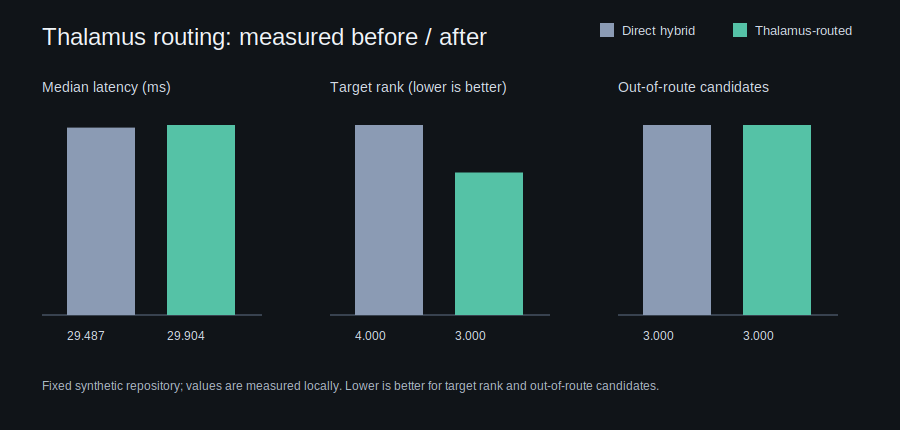

# Sparse Activation Benchmark Report

## Thalamus before/after routing benchmark (v1.2.0)

The current release includes a reproducible, fixed-workload comparison between direct hybrid retrieval and the same retrieval routed through Thalamus. It measures retrieval latency, the first relevant file rank, top-three relevant-file recall, and the number of out-of-route candidates in the top eight results.

Run it with:

```bash
python benchmarks/thalamus_before_after.py --files 250 --runs 5
```

The measured five-run result on this release was:

| Metric | Direct hybrid | Thalamus-routed hybrid |
|---|---:|---:|
| Median retrieval time | 40.621 ms | 43.754 ms |
| Median first relevant-file rank | 4 | 3 |
| Top-3 relevant-file recall | 0% | 100% |
| Out-of-route candidates in top 8 | 3 | 3 |



The chart and raw sample data are committed in `benchmarks/results/`. This is a synthetic routing workload, not a universal quality or performance claim.

**Release:** Cortex Neural Interlink v1.1.0  
**Date:** July 11, 2026

## Purpose

This benchmark checks whether activation work remains bounded below the full assimilated graph for a synthetic linked repository.

## Workload

- 250 generated Python modules
- one README
- ten generated test files
- 262 indexed neural nodes after repository-local integration files were included
- 280 compiled synapses
- deterministic feature-hash embeddings
- activation depth: 2
- activation node budget: 64
- plasticity disabled for repeatability

Run:

```bash
python benchmarks/sparse_activation_benchmark.py --files 250
```

## Observed result

Two clean benchmark runs produced identical activation metrics and state hash. Wall-clock timings varied slightly, as expected.

```json
{
  "indexed_nodes": 262,
  "synapses": 280,
  "bootstrap_seconds_run_1": 0.434194,
  "bootstrap_seconds_run_2": 0.428013,
  "activation_seconds_run_1": 0.003838,
  "activation_seconds_run_2": 0.003926,
  "nodes_considered": 42,
  "nodes_fired": 24,
  "propagation_steps": 30,
  "sparse_activation_ratio": 0.09160305,
  "considered_fraction": 0.16030534,
  "max_depth": 1
}
```

The activation considered 42 of 262 nodes, or about 16.0% of the compiled graph, and fired about 9.2% of all nodes.

Both runs produced this state hash:

```text
cd202d9dd4d7c8052a62fe391accf87dbaedc37390e5881a331dfc894172c4ba
```

## Interpretation

The result demonstrates bounded sparse routing for this synthetic workload. It does not establish universal performance, biological fidelity, or superiority over other retrieval systems. Repository shape, query quality, relation density, hardware, Python version, and storage state affect runtime and sparsity.
