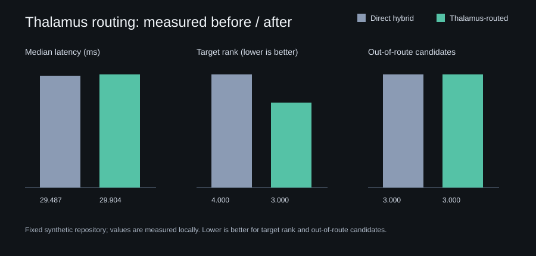
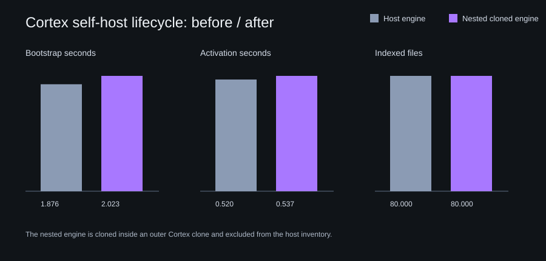

# Sparse Activation Benchmark Report

## Cortex v3.1 / constitutional homeostasis validation (July 28, 2026)

The v3.1 evolution models memory as a bounded balance between context
preservation and adjacent conceptualization. The implemented balance uses the
harmonic mean, so either a lost anchor or uncontrolled adjacency lowers the
score rather than being hidden by a high value on the other axis.

| Measure | Result |
|---|---:|
| Context preservation input | 0.09090909 |
| Adjacent conceptualization input | 0.90909091 |
| Harmonic memory balance | 0.16528926 |
| Constitutional potential | 0.11663 (shadow / observational) |
| Failure quadrant | uncertain / healthy |
| Continuation protocol | 1.1 |
| Rebound local scope | `cortex.canonical.read` |
| Imported packet grants authority | false |
| Python tests | 46/46 |
| ARIA constitutional lattice | 12/12 |
| ARIA full conformance | 512/512 |
| ARIA strict doctor / manifest | pass / 301 of 301 |

The native ARIA example executed these outputs through the verified compiler
and VM:

| Glyph | Meaning | Observed result |
|---|---|---:|
| `⋈` | context weave / memory balance | 0.685714285714286 |
| `≋` | constitutional potential | 0.0875 |
| `⌁` | reversibility burden | 0.880 |
| `↧` | authority descent | false ungranted / true granted |
| `↶` | verified recovery | true for the valid staged candidate |

All five glyphs lower to typed functions and ordinary `CALL` instructions.
These measurements validate deterministic behavior for the declared examples
and controlled thresholds; they are not universal memory-quality or safety
claims.

## Cortex v3 / Aria real-repository validation (July 28, 2026)

### INTERNAL ARIA phase change

ARIA is now a self-contained Cortex component at
`cortex/aria_meta/vendor`, imported as a squashed Git subtree rather than a
submodule. The separate ARIA checkout is no longer a runtime or packaging
dependency. Cortex uses the internal snapshot by default and only integrates a
host-local ARIA surface when one is actually present.

| Measure | Result |
|---|---:|
| Vendored source files | 298 |
| Vendored source size | 1,633,385 bytes |
| Native manifest verification | 297/297 |
| Bundled handshake | ready |
| Bundled strict doctor | pass |
| Bundled full conformance suite | pass (148.827 s) |
| Cortex tests | 43 passed |
| Clean-wheel bundle verification | 297 checked; 0 failures |
| Wheel / source distribution | 612,077 / 473,594 bytes |
| External ARIA repository dependency | false |
| Cortex implementation / execution | Python / Python |
| Automatic ARIA execution / mutation authority | false / false |

The vendored snapshot retains its Apache-2.0 license and notice. These results
establish reproducibility and boundary integrity for this snapshot; they do not
grant ARIA plans automatic execution or source-mutation authority.

### Native-language selective activation

The internal snapshot is compiled as a separate neural region rather than
treated as ambient host evidence.

| Measure | Generic Python task | ARIA continuity task |
|---|---:|---:|
| ARIA mode | dormant | active |
| Total ARIA nodes | 292 | 292 |
| Eligible ARIA nodes | 0 | 40 |
| Considered ARIA nodes | 0 | 15 |
| Fired ARIA nodes | 0 | 10 |
| Total eligible graph nodes | 110 | 150 |
| Total considered nodes | 57 | 64 |
| Retrieval time | 0.050659 s | 0.063255 s |
| Activation time | 0.020443 s | 0.022094 s |

The ARIA task was `ARIA semantic replay cooperative mesh session handoff`; the
generic control was `Fix Python retrieval ranking and run unit tests`. Both
used the same compiled graph and a 64-node activation ceiling. Reproduce this
with `python benchmarks/aria_substrate_benchmark.py`. This verifies selective
availability for these declared tasks, not universal intent classification.
The typed router selected `continuity` and `coordination`, reducing the awake
ARIA surface from 292 nodes to 40.

### Native ARIA fluency evaluation

`python benchmarks/aria_fluency_evaluation.py` evaluates the immutable core
router independently of repository retrieval.

| Measure | Result |
|---|---:|
| Declared cases | 20 |
| Passed | 20 (1.0) |
| False wakes | 0 |
| Missed wakes | 0 |
| Typed-purpose misses | 0 |
| Core cues / typed purposes | 19 / 7 |
| Learned cue ceiling / wake threshold | 32 / 0.65 |
| Exact nested self-host activation | 1.413182 s; verified / ready |

The corpus includes ambiguous controls such as `variable`, generic test replay,
and UI hand-off alongside language, intent, continuity, consent, governance,
coordination, symbolic, and combined ARIA tasks. It is a declared regression
corpus, not proof of general language understanding.

The workload used a clean clone sourced from
`C:\Users\jacks\OneDrive\Desktop\aria-language`. Cortex was attached with
`--external`, so the benchmark wrote no files into the host and Aria's strict
manifest gate remained authoritative.

| Measure | Result |
|---|---:|
| Aria native baseline | strict doctor pass; 500/500 conformance gates |
| Initial Cortex certificate | degraded; retrieval probes 5/8 (62.5%) |
| Tightened Cortex certificate | verified; retrieval probes 7/8 (87.5%) |
| Supported/indexed files | 238 before; 292 after |
| `.aria` / `.cmd` unresolved | 0 / 0 |
| External bootstrap | 10.185 s |
| External activation | 2.965 s |
| Representative CLI query median | 0.369 s |
| Replay answerable-case recall | 5/5 (1.0) |
| Replay mean reciprocal rank | 0.441667 |
| Boundary separation | 1.0 |
| Learned-routing regressions | 0 |
| Unsupported-question abstention | 0/1 at 0.20 threshold |

The remaining abstention miss is retained as a known weakness: an unsupported
external-certification question reached semantic confidence 0.246 rather than
falling below 0.20. The corpus and claim boundary are in
`benchmarks/corpora/aria_language.json`.

### ARIA meta-language validation

The original, non-cloned Aria repository was attached externally after adding
the explicit meta-language boundary.

| Measure | Result |
|---|---:|
| Host writes / Git changes | 0 / clean |
| Certificate / activation | verified / ready |
| Indexed files | 292 |
| Retrieval probes | 7/8 (87.5%) |
| Declared ARIA artifacts | 52 |
| Hidden `.aria/` runtime/backups | excluded |
| Cortex implementation / execution language | Python / Python |
| ARIA role | `host_meta_language` |
| Automatic ARIA execution | false |
| ARIA mutation authority | false |
| Context descriptor | present |
| GCMT continuation descriptor | present |

ARIA handshake and baseline commands returned ready against a valid 297/297
native manifest. Cortex uses these artifacts as semantic and governance
evidence; it does not replace its Python implementation or execute ARIA plans
automatically.

## Verified internal Cortex self-host (July 28, 2026)

| Measure | Host engine | INTERNAL CORTEX ENGINE |
|---|---:|---:|
| Median bootstrap (3 runs) | 3.117 s | 3.314 s |
| Median activation (3 runs) | 0.774 s | 0.764 s |
| Certificate / activation | verified / ready | verified / ready |

The internal engine reported version 3.0.0, matched source commit
`7524ebc9910679c62e3eb115f0892f0736ec50f0`, was excluded from the host
inventory, and passed its nested test run.

## Current controlled workloads (July 28, 2026)

| Measure | Result |
|---|---:|
| Thalamus baseline / routed median | 0.034166 s / 0.033921 s |
| Target rank | 4 -> 3 |
| Top-3 target recall | 0% -> 100% |
| Sparse nodes considered / total | 42 / 262 |
| Sparse nodes fired | 24 |
| Sparse activation ratio | 0.091603 |
| Sparse activation time | 0.005788 s |

These local measurements are benchmark evidence for the declared workloads,
not universal correctness, answer quality, or production-performance claims.

## Cortex evolution telemetry run (July 11, 2026)

| Measure | Result |
|---|---:|
| Versioned vector payload reduction (1,000 vectors) | 34.71% |
| Legacy / migrated mean retrieval | 148.34 ms / 118.77 ms |
| Thalamus target rank | 4 → 3 |
| Thalamus top-3 recall | 0% → 100% |
| Self-host bootstrap / nested bootstrap | 1.876 s / 2.023 s |
| Self-host activation / nested activation | 0.520 s / 0.537 s |

These are local, controlled-workload measurements. They are engineering telemetry, not universal performance, physical-energy, or biological claims.

## Thalamus before/after routing benchmark (v1.3.0)

The current release includes a reproducible, fixed-workload comparison between direct hybrid retrieval and the same retrieval routed through Thalamus. It measures retrieval latency, the first relevant file rank, top-three relevant-file recall, and the number of out-of-route candidates in the top eight results.

Run it with:

```bash
python benchmarks/thalamus_before_after.py --files 250 --runs 5
```

The measured five-run result on this release was:

| Metric | Direct hybrid | Thalamus-routed hybrid |
|---|---:|---:|
| Median retrieval time | 65.690 ms | 55.284 ms |
| Median first relevant-file rank | 4 | 3 |
| Top-3 relevant-file recall | 0% | 100% |
| Out-of-route candidates in top 8 | 3 | 3 |



The chart and raw sample data are committed in `benchmarks/results/`. This is a synthetic routing workload, not a universal quality or performance claim.

## Full self-host lifecycle benchmark (v1.3.0)

This benchmark clones Cortex as an outer host, then compares normal host-engine execution with a second cloned Cortex engine nested inside the host. The nested engine bootstraps and activates the actual outer Cortex repository, while `CortexEngine` is explicitly excluded from the host inventory.

```bash
python benchmarks/self_host_benchmark.py --runs 3
python -m cortex self-test --json
```

| Metric | Host engine | Nested cloned engine |
|---|---:|---:|
| Median bootstrap time | 2.455 s | 3.223 s |
| Median activation time | 0.780 s | 0.834 s |
| Indexed Cortex files | 75 | 75 |
| Verified certificate | yes | yes |
| Nested engine excluded | n/a | yes |



The nested-engine overhead is expected: this measures isolation and correctness, not a speed optimization. The self-test also ran the nested clone's test suite successfully.

**Release:** Cortex Neural Interlink v1.1.0  
**Date:** July 11, 2026

## Purpose

This benchmark checks whether activation work remains bounded below the full assimilated graph for a synthetic linked repository.

## Workload

- 250 generated Python modules
- one README
- ten generated test files
- 262 indexed neural nodes after repository-local integration files were included
- 280 compiled synapses
- deterministic feature-hash embeddings
- activation depth: 2
- activation node budget: 64
- plasticity disabled for repeatability

Run:

```bash
python benchmarks/sparse_activation_benchmark.py --files 250
```

## Observed result

Two clean benchmark runs produced identical activation metrics and state hash. Wall-clock timings varied slightly, as expected.

```json
{
  "indexed_nodes": 262,
  "synapses": 280,
  "bootstrap_seconds_run_1": 0.434194,
  "bootstrap_seconds_run_2": 0.428013,
  "activation_seconds_run_1": 0.003838,
  "activation_seconds_run_2": 0.003926,
  "nodes_considered": 42,
  "nodes_fired": 24,
  "propagation_steps": 30,
  "sparse_activation_ratio": 0.09160305,
  "considered_fraction": 0.16030534,
  "max_depth": 1
}
```

The activation considered 42 of 262 nodes, or about 16.0% of the compiled graph, and fired about 9.2% of all nodes.

Both runs produced this state hash:

```text
cd202d9dd4d7c8052a62fe391accf87dbaedc37390e5881a331dfc894172c4ba
```

## Interpretation

The result demonstrates bounded sparse routing for this synthetic workload. It does not establish universal performance, biological fidelity, or superiority over other retrieval systems. Repository shape, query quality, relation density, hardware, Python version, and storage state affect runtime and sparsity.
