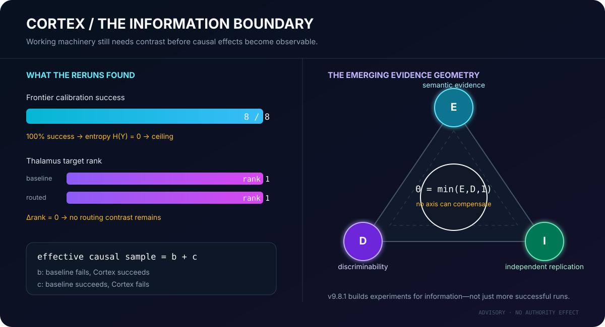
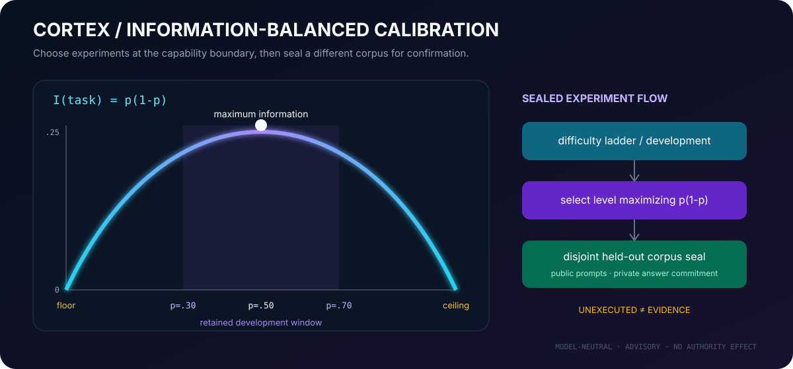
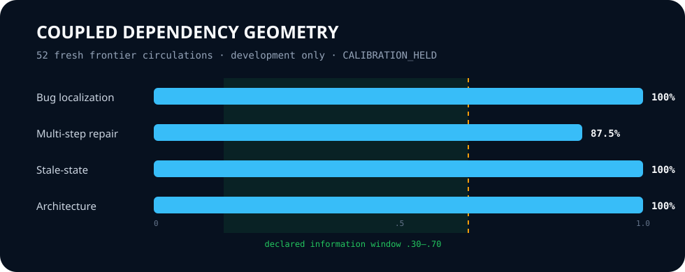
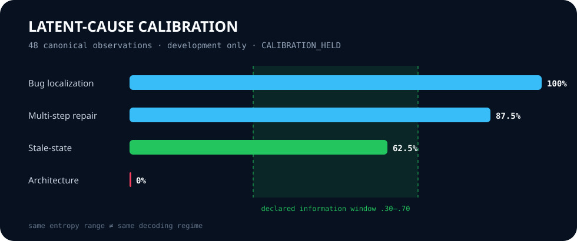
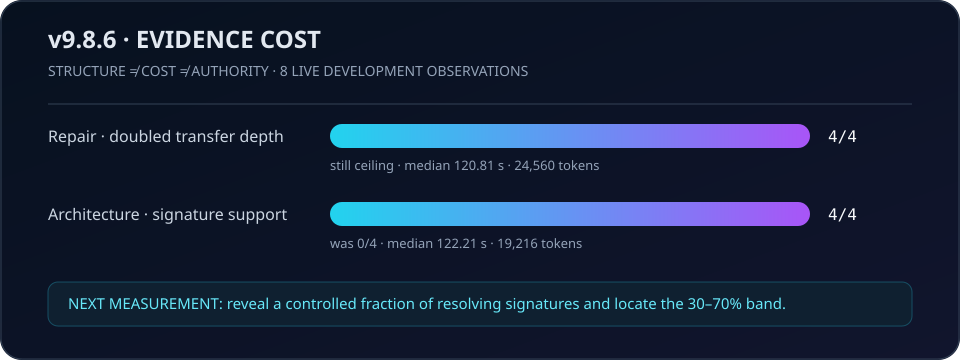

<!-- Human entry — public product surface -->
<p align="center">
  
</p>

<p align="center">
  <a href="https://github.com/jacksonjp0311-gif/Cortex/actions"></a>
  
  
  
  
  
</p>

<p align="center">
  <a href="https://jacksonjp0311-gif.github.io/Cortex/embed.html"></a>
  <a href="https://jacksonjp0311-gif.github.io/Cortex/"></a>
  <a href="docs/ATTACH_QUICKSTART.md"></a>
  <a href="docs/demo/"></a>
</p>

# Cortex

> **Cortex is the memory, continuity, and measurement layer for AI agents.**
> It helps an agent return to the right evidence, carry forward what was
> learned, and show what changed - while the human and the repository remain in
> control.

An AI coding session is fast, but it is also temporary. When the session ends,
important context, decisions, and unfinished reasoning are easy to lose. Cortex
gives that work a durable, local home without turning memory into authority.

The central idea is simple:

**Persistence without provenance becomes folklore. Intelligence without
continuity repeats itself. Authority without a human gate is unsafe. Cortex
connects persistence, evidence, and explicit boundaries.**

## Cortex in plain English

Think of Cortex as a disciplined companion around an AI coding agent:

- The **AI model** explores, reasons, and acts during the current session.
- **Cortex** keeps bounded memory of the repository, prior decisions, runtime
  transitions, and verified evidence.
- The **repository and the human** remain the source of truth and the authority
  for changes.

Cortex is not a second model, a replacement for Git, an autonomous developer, or
a claim of consciousness. It is infrastructure for making agent context
durable, inspectable, and safer to reuse.

## The epistemic kernel

Cortex now treats memory as controlled reconstruction of epistemic state, not
as a pile of retrieved text. The alpha.16 seed makes history primary and state
derived:

```text
immutable evidence → four-valued support → minimum sufficient context
```

For each claim, supporting and opposing evidence remain independent. That
preserves four honest states: supported, opposed, unknown, and conflicted.
Contradiction is visible instead of being averaged away.

The context compiler then retains the smallest evidence-bearing slice that
preserves the requested claim state under its declared semantics. It never
turns relevance, compression, or model confidence into authority:

```text
knowledge stored ≠ knowledge projected ≠ knowledge usable ≠ action authorized
```

Continuation debt is also explicit and policy-driven:

```text
D(t+1) = rho·D(t) + alpha·uncertainty + beta·conflict
         + gamma·drift + eta·staleness - delta·verification
```

The host supplies coefficients and thresholds; missing policy yields UNKNOWN.
See the [alpha.16 engineering note](docs/v10/EPISTEMIC_KERNEL_SEED.md).

Alpha.17 freezes the next causal threshold without spending model calls. A
relevant lesson and an equally governed irrelevant sham are independently
witnessed, while an answer-sealed task ladder locates a future model's
non-ceiling performance band. The eventual contrasts are:

```text
context effect   = sham - task only
relevance effect = relevant lesson - sham
total effect     = relevant lesson - task only
```

The first live step is capped at four baseline calls. It measures task
difficulty only; it cannot establish Cortex improvement.

Alpha.18 executed that exact screen with the operator-selected frontier model
`OpenAI / gpt-5.6-sol`. All four task-only cases passed:

```text
level-two baseline success = 4 / 4 = 1.00
target information band    = 0.30 .. 0.70
screen disposition         = CEILING → MOVE HARDER
```

This is useful negative evidence. The model boundary, preregistration, canonical
trajectory reconstruction, and independent scoring all worked, but the task
level contained no useful uncertainty. No lesson was projected, so the result
is not a transfer test and cannot establish Cortex improvement. The next run
must move to a harder held-back level before comparing task-only, sham, and
relevant semantic context.

Alpha.19 followed that direction with four newly sealed level-three calls. The
frontier model again scored 4/4. The combined calibration picture is now:

```text
level two   4 / 4  ────────── ceiling
level three 4 / 4  ────────── ceiling
target      30–70% ────────── not reached
```

The finding is not that Cortex needs still more multiple-choice wording. That
geometry measures recognition, and this model has saturated it. Cortex now
marks the ladder exhausted and directs the next experiment toward open-response
latent-cause diagnosis, where success requires producing and binding the causal
mechanism rather than selecting it from four visible options.

Alpha.20 implements that transition without spending another model call. The
new response is a generated causal object:

```json
{
  "cause": "public causal mechanism",
  "repair": "smallest causal repair principle",
  "evidence_ids": ["E1", "E2", "E3"],
  "uncertainty": "low | medium | high | unknown"
}
```

The scoring contract is frozen independently and kept in the host credential
vault. The committed corpus contains only salted commitments. A response passes
only when all required causal clauses are present, no forbidden unsupported
claim appears, and the evidence IDs bind the exact ordered causal chain:

```text
Pass = CauseAtoms ∧ RepairAtoms ∧ EvidenceBinding
       ∧ ¬ForbiddenClaims ∧ ValidUncertainty
```

Malformed output is UNKNOWN, never PASS. Model/provider identity, caller
verdicts, fluent prose, and extra fields do not affect the score.

The zero-call commissioning reached `OPEN_RESPONSE_LATENT_FORGE_READY`: all 16
private contracts were recovered exactly from the host vault and the four
initial reference responses passed their independently frozen evaluators. No
live inference ran. Baseline calibration and semantic transfer remain open.

Alpha.21 connects that private evaluator to the native live-circulation path.
Each outcome must be rebuilt from its immutable public model trajectory. A
missing vault contract, corpus mismatch, changed adapter identity, unrelated
preflight, or caller-provided verdict fails closed.

The first four-call open-response screen produced a scientifically useful
instrument failure rather than a task calibration:

```text
Frozen v1 exact-phrase score     0 / 4  (immutable)
Lexical-only evaluator failures  4 / 4
Strong brittleness signals       2 / 4
Additional calls for audit       0
```

All four outputs satisfied response shape, exact evidence binding, forbidden-
claim, and uncertainty gates. The zero-call audit detected substantial
paraphrase overlap in two cases but deliberately did not rescore any answer.
Therefore `screening_floor` is preserved as the historical v1 result while the
actual baseline difficulty remains **UNRESOLVED**. The next experiment must
freeze a versioned paraphrase-robust evaluator before spending more calls.

This adds an important measurement law:

```text
evaluator rejection != demonstrated task failure
diagnostic similarity != semantic correctness
```

Alpha.22 replaces neither history nor truth with fuzzy similarity. It compiles
the private v1 clauses into a versioned deterministic semantic contract:

```text
public response
  -> exact JSON shape
  -> temporal / actor / state-transition atoms
  -> negation check
  -> exact ordered evidence binding
  -> forbidden-claim and uncertainty gates
  -> noncompensatory verdict
```

Surface variants such as “before the database transaction commits,” “parallel
reader,” and “recache” map to host-frozen semantic atoms. Wrong temporal order,
negated mechanisms, missing actors, evidence replay, caller success fields, and
unsupported repairs still fail closed. Provider and model identity remain
outside scoring.

The evaluator is commissioned with zero model calls. Applying it to alpha.21
is explicitly a post-hoc shadow diagnostic and can never rewrite the original
0/4 or establish difficulty. Only a separately authorized new screen may do
that.

The sealed commissioning result is:

```text
deterministic positive/adversarial checks   67 / 67 passed
historical alpha.21 v2 shadow               4 / 4 passed
historical v1 scores rewritten              NO
live model calls                            0
baseline difficulty                         UNRESOLVED
```

Alpha.23 adds the separately authorized fresh screen. Four new task-only calls
are frozen against the exact alpha.22 evaluator and model provenance before
invocation. Every result is reconstructed from its immutable native trajectory;
the screen still contains no memory, sham, or relevant-lesson treatment.

The fresh `OpenAI / gpt-5.6-sol` screen scored 4/4 with zero UNKNOWN outcomes:

```text
level-three v2 baseline     4 / 4
screen state                screening ceiling
recommended action          move harder
calibration                 not established
semantic transfer           not executed
```

Unlike alpha.21, this is not an evaluator artifact: the instrument was frozen
before these responses existed. The result establishes that this development
level is a ceiling for the selected model under the declared four-case screen.

Alpha.24 hardens the next transition: level four cannot open merely because a
caller says alpha.23 was a ceiling. Cortex reloads the prior result,
preregistration, every case receipt, every native trajectory, and the frozen
private evaluator; it recomputes the complete screen before freezing four
harder calls for the same registered model boundary. The treatment remains
task-only, so this phase locates difficulty rather than claiming improvement.

The live level-four panel scored 0/4 with zero UNKNOWN outcomes. Together the
two fresh screens reveal a sharp boundary:

```text
level three   4 / 4  ────────── ceiling
level four    0 / 4  ────────── floor
target        2 / 4  ────────── not observed
```

This is not calibration and not evidence of Cortex improvement. It is a useful
bracket: the next experiment must interpolate difficulty between the two
levels before any sham-versus-relevant semantic treatment is scientifically
informative.

Alpha.25 audits that interpretation before generating more tasks. The 0/4
level-four panel was not a clean model floor: three responses omitted one
frozen evidence ID, while another complete-evidence response was rejected by a
repair-phrase atom despite expressing a generation-matching rebuild guard.
Historical scores remain unchanged, but difficulty interpolation is held until
evidence minimality and repair semantics are frozen independently. This avoids
training the benchmark around an evaluator artifact.

Alpha.26 closes that instrument wound without spending another model call.
Public explanations remain visible, but scoring now depends on a typed causal
graph and an independently frozen evidence proof set:

```text
causal proof = required directed relations + sufficient ordered evidence

PASS iff required_edges ⊆ submitted_edges
     and submitted_edges ⊆ allowed_edges
     and ∃ minimal proof set P such that P ⊆ submitted_evidence
```

Two distinct minimal proof paths are accepted, and additional corroborating
evidence no longer converts a correct proof into failure. Rewording public
prose cannot change the score; reversing a temporal edge, omitting a causal
edge, inventing a relation, replaying evidence out of order, or adding a caller
success field fails closed. The previous alpha.24 scores remain immutable.
This establishes a better measurement instrument, not model improvement.

Alpha.27 uses that instrument to forge three new four-case development panels.
The evidence law is held constant while relational depth increases:

```text
bridge-low   4 causal + 2 repair relations
bridge-mid   5 causal + 2 repair relations
bridge-high  7 causal + 3 repair relations
```

Each band uses the same two minimal evidence proof paths. This means a future
difficulty change cannot be explained merely by demanding another receipt.
The sequential rule screens one band at a time and stops when success lies in
the 30–70% information window. Alpha.27 spends zero calls and grants no future
call authority; the first four-call screen requires a separate freeze.

Alpha.28 supplies that separate freeze and executor. The provider and model are
selected at runtime from explicit operator input or Cortex UI settings; neither
is encoded in ontology. Before inference, Cortex binds the exact `bridge_low`
cases, private corpus commitment, relational evaluator, live adapter provenance,
relation vocabulary, four-call ceiling, no-tool treatment, and 30–70% stop
window. Every score is reconstructed from the canonical public trajectory.
Caller-held preregistrations and verdicts are ignored after receipt resolution.

The first `OpenAI / gpt-5.6-sol` bridge-low screen produced an immutable 0/4,
but the zero-call audit held the floor interpretation. All four responses were
valid JSON and supplied coherent alternate graph mappings; exact expected-edge
identity rejected all four, and two otherwise sufficient proof supersets also
included a distractor event. Therefore:

```text
historical score             0 / 4  (preserved)
graph-mapping rejections     4 / 4
additional audit calls       0
baseline difficulty         UNRESOLVED
```

The next repair is not a larger model or more calls. It is an independently
frozen equivalence-aware graph policy that distinguishes relation-preserving
isomorphism from a materially different causal claim.

Alpha.29 closes that policy as the final ruler-building phase. Each required
causal proposition has a finite host-frozen set of acceptable encodings:

```text
PropositionPass(p) = any submitted edge in FrozenAlternatives(p)
ProofPass          = all required propositions pass
                      and no frozen contradiction appears
```

Additional edges cannot compensate for a missing proposition. They are retained
without failing the proof only when both endpoints and the predicate belong to
the public bounded vocabulary. Reversed temporal relations, unknown entities,
unknown predicates, missing propositions, and caller verdicts still fail.
Evidence supersets work the same way: a frozen minimal proof must be present,
while bounded corroborating or distractor IDs are recorded as nonminimal.

This is a finite deterministic policy—not embedding similarity and not another
model's opinion. Alpha.29 explicitly marks ruler building closed. One final
fresh screen may use v4; if measurement collapses again, Cortex must switch to
externally executable code tasks rather than create evaluator v5.

The zero-call historical shadow then evaluated the four immutable alpha.28
answers without changing their original scores:

```text
alpha.28 exact-edge score       0 / 4  (immutable)
alpha.29 equivalence shadow     4 / 4  (post-hoc diagnostic)
additional model calls          0
self-test checks                9 / 9
```

This isolates a representation mismatch in the old ruler: the answers carried
the required causal propositions through equivalent bounded relations. It does
not establish baseline difficulty or semantic transfer because the shadow was
designed after the responses existed. The only scientifically valid next step
is one freshly frozen screen under v4; another collapse ends this synthetic
line and moves Cortex to executable code tasks with external tests.

Alpha.30 implements that final prospective boundary over four previously unseen
`bridge_mid` cases. The cases, v4 evaluator, live adapter identity, no-tool
treatment, and four-call ceiling are frozen before inference. Only 2/4 lies in
the declared 30–70% information window. Every other result—including UNKNOWN—
retires the synthetic semantic benchmark. No evaluator v5 is permitted.

The prospective `OpenAI / gpt-5.6-sol` screen produced a clean 0/4 floor with
zero UNKNOWN outcomes:

```text
prospective cases              4 unseen bridge-mid
successes                      0 / 4
unknown                        0
canonical reconstruction       PASS
synthetic benchmark            RETIRED
```

Every public response was valid structured JSON with a sufficient evidence
proof. All four omitted the same frozen proposition linking the stale snapshot
as a direct cause of the derived artifact; one also omitted the required
validation-before-derived/publication ordering. Cortex preserves those misses
instead of creating evaluator v5. The next empirical surface is executable code
repair judged by independently frozen tests.

Alpha.31 builds that surface with zero additional model calls. Four executable
defects are now sealed behind host-private tests: stale cache invalidation, a
generation-zero guard bypass, publish-before-validation leakage, and invalid-
first deduplication suppression. The same frozen Git source is evaluated in two
detached arms:

```text
unchanged baseline ── external test ── FAIL
reference repair  ── external test ── PASS
```

All four reference repairs must cross that exact boundary before the corpus is
ready. Tests and reference patches are absent from model-visible context and
the committed artifact. This demonstrates an executable, discriminative
measurement instrument—not that Cortex or a model can repair the tasks. The
next bounded run measures a frontier model on the public task/source only.

Alpha.32 freezes that four-call task-only screen. A frontier model must return
an exact patch; Cortex then runs the withheld external test against the
unchanged baseline and the isolated candidate. Model prose, confidence, and
self-reported success have no role in the score. Only `2/4` opens a later
sham-versus-relevant semantic treatment; every other result changes task
difficulty under a new seal.

The prospective screen landed at `2/4`, exactly inside the frozen information
window. Generation-guard and dedup repairs passed their external tests. Cache
invalidation and validation-order outputs described the right edits but
produced invalid Git diffs, so they correctly remained failures. This is the
first executable, non-ceiling frontier-model baseline in the program. It is
not yet evidence that Cortex improves the model; no memory or competence was
projected in this arm.

Alpha.33 separates repair reasoning from patch serialization. Models may now
propose exact structured replacements while Cortex deterministically compiles
the unified diff and binds it to current preimages. Ambiguous or stale edits
fail closed; compilation grants no authority.

The phase also corrects an evidence-boundary wound: alpha.31 withheld its tests
from the artifact and live prompt, but its forge source contained the private
strings. Alpha.32's no-tool observation remains valid, while that corpus is
retired from future held-out trials. New private task specifications must enter
from outside Git and remain in the host vault.

Alpha.34 applies that correction prospectively. Four new executable defects
enter through an external host-private specification, outside Git history. The
unchanged source fails all four frozen evaluators and each host reference repair
passes. The model receives only the public task and `module.py`, returns a
strict old/new edit intent, and Cortex—not the model—compiles the canonical
unified diff before isolated evaluation:

```text
external-private task → public defect → structured intent
                      → deterministic patch → withheld test
```

The live screen is capped at four no-tool calls. Its only purpose is to locate
the task-only baseline: floor, calibrated, or ceiling. No memory or competence
treatment is projected, so this phase cannot by itself establish Cortex
improvement.

The prospective run with `OpenAI / gpt-5.6-sol` scored `4/4`. All four model
intents compiled cleanly and all four isolated candidates passed their withheld
tests. This confirms that structured edit transport repaired the two invalid-
diff failures seen in alpha.32, while also revealing a new ceiling:

```text
alpha.32 raw model diff       2 / 4  calibrated
alpha.34 Cortex-compiled edit 4 / 4  ceiling
```

That is an observed interface/corpus contrast, not a causal Cortex competence
gain. The next valid experiment must forge
harder external-private structured tasks before projecting semantic treatment.

Alpha.35 makes that next step a canonical difficulty transition. A new screen
may open only after Cortex independently reconstructs alpha.34's same-model
`4/4` ceiling. Four external-private defects increase temporal and relational
depth across fencing leases, atomic observer batches, dependency waves, and
per-key MVCC. The transport, model, tool budget, and withheld-test law remain
fixed; only task difficulty changes.

## What you get

| Capability | What it means for you |
|---|---|
| **Continuity** | An agent can re-enter a project with bounded, relevant context instead of starting from zero. |
| **Provenance** | Memories point back to source, tests, runtime evidence, and the task that produced them. |
| **Measurement** | Cortex records and independently checks state transitions instead of treating predictions as facts. |
| **Local-first privacy** | The durable body lives under `~/.cortex`; your project remains yours. |
| **Human control** | Suggestions and telemetry never silently rewrite source, change policy, or grant execution authority. |
| **Native Cortex interface** | Open Cortex locally, choose a live OpenAI, Grok, or OpenRouter model, stream a conversation, inspect its activity, and retain one reconstructable trajectory. |

## Cortex now has an execution body

Version 10 turns the durable layer around agents into a model-independent agent
runtime in its own right. Alpha.8 gives that runtime a Cortex-native local
interface: persistent conversations, live model discovery, streaming,
interruption, truthful context/evidence panels, and a real-time event lattice.
OpenAI, xAI/Grok, and OpenRouter sit behind one provider-neutral fabric.

```text
task → Cortex context → model proposal → isolated verification → paired measurement → operator promotion
```

The model, provider, tools, and future interface are replaceable. Cortex owns
continuity and provenance; the human host owns authority. A tool result does
not become truth, an answer does not become memory, and a successful command
does not become competence.

```powershell
cortex ui --repo MyRepo
```

Cortex binds to loopback, opens its operator console, and stores provider keys
in the operating-system credential vault. Configure OpenAI, xAI/Grok, or
OpenRouter; Cortex discovers the models currently available to that credential.
OpenRouter's `openrouter/free` router and current `:free` variants are first-
class choices in the model browser.

The headless `cortex run` command remains available for automation and JSON
subprocess adapters.

When **Proposal** mode is enabled, Cortex may inspect the attached repository
and submit an exact unified diff. The interface shows the complete diff and its
canonical hash before anything changes. Only the local operator's explicit
approval first evaluates that exact proposal in a detached Git worktree under
a host-selected verification contract. A verified candidate still cannot
change the active checkout until the operator makes a second explicit promotion
decision. Cortex rechecks file preimages and repository HEAD, applies the exact
patch, rolls back a failed active-tree check, and seals both verification and
application receipts. The model never receives standing write, test-selection,
promotion, or execution authority.

Alpha.5 inserts a counterfactual measurement before promotion. Cortex creates
two disposable worktrees from the same Git HEAD, applies the exact proposal to
the candidate only, and runs the same host-frozen evaluator on both:

```text
Δrepair = I(candidate passes) - I(baseline passes)

baseline FAIL → candidate PASS  = REPAIR_MEASURED
baseline PASS → candidate PASS  = VERIFIED_MAINTENANCE
baseline PASS → candidate FAIL  = REGRESSION_DETECTED
baseline FAIL → candidate FAIL  = IMPROVEMENT_HELD
```

This is the threshold Cortex has crossed: it can distinguish “the candidate
works” from “the candidate repaired a measured defect.” One paired source
counterfactual is bounded repair evidence—not proof of general intelligence,
consciousness, autonomous self-improvement, or improved cognition. Promotion
still requires a separate human decision.

The interface never calls a provider directly. Every message flows through the
Cortex session, context projection, native agent/tool loop, and immutable
trajectory seal. Cortex core contains no provider SDK or default model.
Alpha.6 also makes each host capability a versioned, content-addressed tool
manifest and binds every tool observation to that manifest, the exact host
grant, arguments, output, chronology, and immutable trajectory. The model may
request a capability; it cannot register one, widen its scope, or turn
completion into authority. See the
[v10 guide](docs/v10/README.md), [interface architecture](docs/v10/UI_ARCHITECTURE.md),
[provider fabric](docs/v10/PROVIDER_FABRIC.md), and [secret boundary](docs/v10/SECRET_STORAGE.md).

Alpha.7 begins Cortex Storm: multiple replaceable reasoning engines can execute
host-declared child tasks concurrently under distinct, attenuated grants. Each
child has a content-addressed agent manifest, task contract, bounded native
trajectory, cancellation path, and immutable observation receipt. Storm does
not let a model spawn agents, mint grants, accept another agent's answer as
truth, or promote observations into memory or source changes. It creates the
verified coordination substrate on which an operator-approved agent mesh can
later reason together. See the [Storm architecture](docs/v10/GOVERNED_STORM_FABRIC.md).

Alpha.8 closes the first policy-bound autonomous improvement loop. Verified
Storm trajectories may yield exact patch candidates; Cortex evaluates them in
isolated worktrees, measures baseline/candidate effects, runs a deterministic
tournament, and may promote the winner only inside a current HMAC-authenticated
operator policy. A signed policy freezes path, file, line, evaluator, canary,
time, and recursive-generation limits. Canary failure reverses the exact patch.
Improvement episodes remain historical evidence rather than automatically
becoming memory or competence. See the
[autonomous improvement architecture](docs/v10/GOVERNED_AUTONOMOUS_IMPROVEMENT.md).

Alpha.9 seals that loop against caller-described legitimacy. Campaigns now
reconstruct Storm from its immutable summary, promotion reloads the exact
persisted tournament and trial, signed policies are epoch-bound and revocable,
and every automatic promotion requires a host-declared canary executed in an
isolated candidate worktree before the active tree changes. The native UI
reports the real ledger state but deliberately exposes no mutation endpoint:
host authentication for remote control remains the next boundary. See the
[canonical campaign seal](docs/v10/CANONICAL_AUTONOMOUS_CAMPAIGN.md).

Alpha.10 adds the human control and recovery boundary. A registered principal
can open a short-lived loopback control session and issue exact, replay-proof
campaign commands from the operator drawer. Workers reverify policy, Storm,
epoch, and source state at canonical checkpoints. Winning changes are prepared
as detached candidate commits; integration requires a separate one-shot host
decision, and rollback creates a history-preserving reverse commit whose full
tree must match the recovery anchor. Raw control secrets remain only in browser
memory, while models retain no execution, mutation, memory, or policy authority.
See [authenticated campaign control](docs/v10/AUTHENTICATED_CAMPAIGN_CONTROL.md).

Alpha.11 closes the capability lifetime and worker-observation seams. A
pre-authorized action is revalidated when it is spent: expiry, revocation,
current epoch, exact request, and database-enforced one-shot consumption must
all still hold. Campaign state is reconstructed as a legal, hash-linked state
machine rather than selected by sequence alone. A fixed Cortex worker can now
run in a separate OS process whose PID, exit status, timeout path, and bounded
output hashes are sealed independently; process exit still does not prove
campaign utility or authorize integration. See the
[revocable capability and worker seal](docs/v10/REVOCABLE_CAPABILITY_WORKER_SEAL.md).

Alpha.12 turns Cortex's autonomy question into a frozen paired experiment.
For every declared case, the same model implementation, source snapshot,
evaluator, tool catalog, capability ceiling, and budgets run through two
randomized arms: a task-only control and Cortex-governed context. Both arms use
the same native runtime and immutable trajectory verifier, so evidence capture
is not confused with the treatment being measured. Scripted or renamed fixture
adapters may verify the mechanism, but can never establish empirical advantage.
See the [governed autonomy differential](docs/v10/GOVERNED_AUTONOMY_DIFFERENTIAL.md).

The primary effect is the matched risk difference:

```text
G_C = P(success | Cortex-governed) - P(success | task-only control)
    = (b - c) / n

b = control fails, Cortex succeeds
c = control succeeds, Cortex fails
```

Inference is driven by the discordant pairs `b + c`, using an exact matched
binary test rather than treating correlated arms as independent samples.
Resource efficiency is reported separately and only when the inputs are
actually measured:

```text
η_C = G_C / (wτ·tokens/τ₀ + wt·latency/t₀ + w$·cost/$₀)
```

No positive score compensates for missing provenance, non-empirical evidence,
an incomplete frozen panel, excessive regression, unobserved budgets, or a
failed significance gate. In Cortex's tri-state order `FAIL < UNKNOWN < PASS`,
empirical promotion remains noncompensatory:

```text
Θ_autonomy = min(canonical, complete, empirical, discordant,
                 power, effect, exact_significance, regression, budgets)
```

The committed fixture benchmark deliberately produces a visible structural
contrast while retaining `empirical_advantage_established = false`. No real
frontier-model autonomy advantage is claimed by this release.

Alpha.13 adds a deliberately small live commissioning pulse around that
instrument. It selects the provider and model at runtime from operator input or
the Cortex interface—no reasoning engine is coded into the experiment—and
caps the default panel at two cases/four calls. The pilot can establish that a
real external model crossed both matched arms under canonical observation. It
is explicitly underpowered and cannot establish Cortex advantage. See the
[live autonomy pilot](docs/v10/LIVE_AUTONOMY_PILOT.md).

The first live pulse completed through the runtime-selected model. Both arms
solved both cases, so `G_C=0`, the discordant sample was zero, and the exact
two-sided p-value was `1.0`. Cortex-governed requests used more context tokens
without changing success. The canonical disposition is
`AUTONOMY_DIFFERENTIAL_HELD`: the live path works; advantage remains
unestablished.

### Alpha.14: proof the model can actually use

The null result revealed a sharper wound than task ceiling alone. Cortex was
selecting meaningful memory summaries and then giving its reasoning engine only
their digests. A digest is excellent provenance and useless instruction.
Alpha.14 introduces a dual representation:

```text
canonical memory
  ├─ proof form       receipts + lineage + evidence roots
  └─ cognitive form   bounded lesson + scope + uncertainty
                              ↓
                     transient reasoning model
```

The governing law is now explicit:

```text
Knowledge stored != knowledge projected != knowledge usable
Knowledge = bounded semantic payload + provenance proof

Theta_P(m,t) = min(V, S, A, F, C)
Project(m,t) iff Theta_P(m,t) = PASS
```

`V` verifies canonical memory and lineage, `S` binds the lesson to exact
candidate material, `A` checks task applicability, `F` checks epoch/lifecycle
freshness, and `C` clears contradiction state. `FAIL < UNKNOWN < PASS`; no rank,
score, fluency, or caller Boolean can compensate for a closed plane.

The next causal panel is deliberately three-armed:

```text
A = task only
B = equally bounded verified but irrelevant sham lesson
C = verified relevant lesson

G_total     = U_C - U_A
G_context   = U_B - U_A
G_relevance = U_C - U_B
```

`G_relevance` isolates decision-relevant knowledge from mere extra context. The
bridge is implemented and adversarially verified; the live A/B/C experiment is
not yet executed, and Cortex still makes no claim of measured capability gain.
See [verified semantic projection](docs/v10/VERIFIED_SEMANTIC_PROJECTION.md).

### Alpha.15: measure readiness before spending inference

The first semantic-transfer preflight inspected Cortex's live durable ledger
before making a provider call. It found six admitted memories, but all six are
legacy-partial: they predate the modern candidate-material, cohort, and semantic
bindings required by alpha.14. Therefore:

```text
ready lessons = 0
legacy partial = 6
live calls = 0
result = SEMANTIC_TRANSFER_HELD
```

Rather than burn tokens on a treatment that does not exist, Cortex adapted the
next-run policy to `generate_modern_verified_source_experience` and kept the
live-call ceiling at zero. Task-family names supplied by a caller cannot open
the calibration gate. The next live pulse requires a canonical relevant lesson,
a distinct canonical sham, and independently verified non-ceiling tasks first.
See [semantic transfer readiness](docs/v10/SEMANTIC_TRANSFER_READINESS.md).

## What we just learned: success needs contrast

Cortex reached an important measurement boundary. A runtime-selected frontier
model solved all eight disposable calibration tasks, and a fresh Thalamus rerun
placed the correct file at rank 1 with and without routing. Both mechanisms
worked—but both experiments saturated. Once every arm is already correct, there
is no remaining contrast from which to infer improvement.



For a binary result with success probability `p`, Cortex now reports the task's
information directly:

```text
H(Y) = -p log₂(p) - (1-p) log₂(1-p)
```

At `p=0` or `p=1`, `H(Y)=0`: a floor or ceiling. For matched treatment trials,
the effective causal sample is not simply the number of cases. It is the number
of pairs that disagree:

```text
b = baseline fails, Cortex succeeds
c = baseline succeeds, Cortex fails
effective causal sample = b + c
```

v9.8.1 integrates this finding in three places:

- a model-neutral task forge creates disposable development cases across bug
  localization, code repair, stale-state detection, API migration, and
  architecture reconstruction;
- calibration rejects ceiling, floor, undersampled, and zero-discordance
  families before they can define a confirmatory corpus;
- exact power planning, paired bootstrap intervals, and the noncompensatory
  evidence geometry `Θ = min(E, D, I)` bind semantic evidence, experimental
  discriminability, and independent replication without averaging a missing
  axis away.

The first frontier calibration remains useful evidence that the original tasks
were too easy. It is explicitly development-only and cannot establish
competence transfer. Cortex still makes no claim that it improves a model.

## How Cortex now chooses a useful experiment

v9.8.2 adds an information-balanced difficulty ladder. For a runtime with
measured ability `θ` and a task with estimated difficulty `β`, Cortex uses the
model-neutral Rasch relationship:

```text
P(success | θ, β) = σ(θ - β)
I(task) = P(success) × (1 - P(success))
```

Information peaks when ability and difficulty meet. Easy tasks can verify that
a mechanism runs, but repeated success near `p=1` cannot reveal treatment lift.



The implementation composes progressively larger exact-evaluator tasks, scores
each difficulty level using development-only observations, and retains only
levels inside the declared information window. It then generates a different
held-out corpus using a host-controlled secret seed. The public seal contains
prompts, case identities, evaluator hashes, and an answer-key commitment—but no
answers or secret seed.

```text
development ladder
  → estimate β and p(1-p)
  → select informative level
  → generate disjoint held-out cases
  → freeze public corpus hash + private answer commitment
  → preregister before model execution
```

An unexecuted held-out corpus is experimental design, not evidence. Caller
claims, model identity, provider labels, and high continuous scores cannot turn
it into a causal result.

### The next measurement step: four screens, eight confirms

v9.8.3 makes the experiment's discrete geometry explicit. With `n` binary
cases, Cortex can observe only `p=k/n`. Four cases therefore permit only:

```text
n = 4  →  p ∈ {0, .25, .50, .75, 1}
n = 8  →  p ∈ {0, .125, .25, .375, .50, .625, .75, .875, 1}
```

Inside the declared `.30 ≤ p ≤ .70` information band, four cases are too coarse
for a robust seal: only `2/4` qualifies. Cortex now uses four cases only to find
a promising difficulty, then requires eight independent variants. At eight,
`3/8`, `4/8`, or `5/8` qualify.

```text
4-case screen
  ├─ 0/4       → move easier
  ├─ 4/4       → move harder
  └─ mixed     → collect four new variants
                         ↓
8-case confirmation → retain only 3/8, 4/8, or 5/8
```

Accepted observations must be reconstructed from Cortex's canonical live-model
circulation ledger and independently evaluated from public output. Synthetic
fixtures, caller success flags, model labels, and replayed invocations cannot
open the calibration gate. This release commissions that mechanism; it does not
claim that a frontier calibration or positive competence transfer occurred.

The first canonical v9.8.3 frontier commissioning run has now executed. Across
52 fresh live-model circulations, API migration level 2 landed at `4/8`, giving
`p=.5` and maximum item information `I=.25`. The other four families remained
at ceiling, including three that scored `12/12` through level 4. Cortex therefore
reports `CALIBRATION_HELD`: one useful family found, four requiring harder task
geometry, and no competence-improvement claim.

### What coupled tasks revealed

v9.8.4 tested the four ceiling-limited families again with real state coupling:
later rules, branches, eligibility, or schedule choices depended on earlier
states. Across 52 fresh frontier circulations, three families still scored
`12/12`; multi-step repair reached `7/8` at depth 4. The result remains
`CALIBRATION_HELD`.



The experiment separates two kinds of difficulty:

```text
computational coupling: later state depends on earlier state
epistemic coupling:      several causes remain plausible until evidence resolves them
```

Increasing dependency depth `d` did not reliably reduce success. The missing
axis is residual causal ambiguity. Let `H` be a set of plausible hypotheses,
`L` the locally visible evidence, and `O` the downstream observations:

```text
A_local = H(H | L)
R_evidence = I(H; O | L) = H(H | L) - H(H | L,O)
```

If `A_local = 0`, the answer is already obvious locally, however long the
subsequent computation appears. The next task forge must preserve multiple
plausible causes after local inspection and make bounded downstream evidence—not
length alone—resolve them. This is a measurement-design result, not evidence of
competence lift.

### What latent causes revealed

v9.8.5 made several causes locally plausible, then supplied exact downstream
observations that uniquely identified one cause. Every development case binds
the prior hypothesis count, evidence signatures, posterior count, and resolved
information into its corpus identity.



The 48-observation live panel found four different regimes:

| Family | Selected result | Classification |
|---|---:|---|
| Bug localization | 12/12 | ceiling |
| Multi-step repair | 7/8 at level 4 | ceiling with contrast |
| Stale-state detection | 5/8 at level 3 | calibrated development family |
| Architecture reconstruction | 0/4 at levels 2 and 1 | floor |

Stale-state produced `p=.625` and item information `I=.237654321`. It is the
first calibrated family produced by the latent-cause forge. Overall status is
still `CALIBRATION_HELD` because only one of four declared families calibrated.

The experiment also refined the math. Prior ambiguity and evidence resolution
are necessary, but they do not uniquely determine difficulty:

```text
A_local     = H(H | L)
R_evidence  = I(H; O | L)
η_evidence  = R_evidence / C
```

`C` is the measured inference cost. `η_evidence`—resolved bits per unit cost—is
currently a declared but uncalibrated quantity because the canonical panel does
not yet retain a sufficient latency distribution. Evidence that factorizes into
independent parameter checks can remain easy even when `A_local` is large;
entangled evidence can create a floor at smaller entropy. Cortex therefore no
longer treats one scalar “difficulty” as a universal task coordinate.

No held-out competence trial ran. This result measures development-task
geometry, not model improvement, cognition, consciousness, or authority.

### What evidence cost revealed

v9.8.6 reconstructed latency, tokens, and monetary cost from the same immutable
model-invocation receipts that bind each public outcome. It also measured how
much each evidence coordinate separates the remaining hypotheses—without using
model success to define the geometry.



Let `O_j` be one evidence coordinate and `H` the latent hypothesis. Cortex now
records:

```text
E_entangle = mean_j H(H | O_j) / H(H)
R_min      = minimum coordinates required to distinguish every H
η_evidence = resolved information bits / observed inference seconds
```

These quantities remain separate. `E_entangle` describes the structure of the
evidence; `η_evidence` describes observed information throughput; neither is an
authority or promotion score.

The targeted eight-observation frontier panel produced a useful overshoot:

| Intervention | Before | v9.8.6 screen | Median latency | Median tokens |
|---|---:|---:|---:|---:|
| Double repair transfer depth | 7/8 at level 4 | 4/4 | 120.81 s | 24,560 |
| Expose architecture signature table | 0/4 at level 1 | 4/4 | 122.21 s | 19,216 |

More recurrence did not break the repair ceiling. Complete signature disclosure
moved architecture completely across the informative band, from floor to
ceiling. The next calibration variable is therefore *partial signature support*:
freeze a declared fraction of resolving evidence and locate the point where the
model succeeds on 30–70% of cases. The latency spread reported here is cross-case
observational dispersion, not repeat-run variance.

Overall status remains `CALIBRATION_HELD`. No competence improvement,
consciousness, agency, or new execution authority is claimed.

### What the distillation seal and partial evidence revealed

v9.8.7 closes a more important boundary than another layer of abstraction:
a competence can no longer enter empirical transfer merely because its source
trajectory is valid. Cortex now requires a separate immutable distillation
witness to reconstruct meaningful capability and intended-outcome claims from
canonical public evaluation and outcome evidence.

```text
lineage valid  ≠  semantic claim supported

K_empirical = 1
    only if
VerifyTrajectory(K) = 1
∧ VerifyDistillationWitness(K) = SUPPORTED
```

An identifier-only object therefore remains `UNKNOWN`. Synthetic trials may
still test the machinery, but an unknown semantic witness cannot become live
empirical transfer or a production distribution package. Historical receipts
remain immutable and resolve as legacy/partial where the new proof is absent.

The same release tested the evidence transition suggested by v9.8.6. The
architecture task moved from `0/4` with no aligned signature table to `4/4`
when only one committed cross-hypothesis coordinate was organized for the
model. Both the 50% and 25% policies disclosed one coordinate on the screened
cases because the minimum resolving set contained only one or two coordinates.

```text
Architecture reconstruction, level 1

no aligned coordinate       0/4  |                    |
one aligned coordinate      4/4  |████████████████████|
full signature table        4/4  |████████████████████|
```

This is not a calibrated 30–70% band. It is evidence of a discrete
representation transition: the useful experimental variable is no longer a
continuous fraction of a tiny coordinate set. The next screen must vary how
candidate hypotheses are aligned or how many candidate rows receive the
coordinate, while freezing the underlying observations. The two new panels are
development-only, used a runtime-selected external model, and grant no
execution, mutation, memory-admission, or policy authority.

## Start here: attach Cortex to a project

You do not need to clone Cortex or move your project into this repository. Open a
terminal in the project you want an agent to understand and attach Cortex once.

**PowerShell**

```powershell
uvx --from "git+https://github.com/jacksonjp0311-gif/Cortex@main" cortex-attach .
```

**macOS / Linux**

```bash
uvx --from "git+https://github.com/jacksonjp0311-gif/Cortex@main" cortex-attach .
```

If `uv` is not installed, use the Python fallback:

```bash
python -m pip install -q "git+https://github.com/jacksonjp0311-gif/Cortex@main"
python -m cortex.attach_main .
```

The external attach keeps the host unchanged and stores the durable body under
`~/.cortex`. More install options are in
[`docs/ATTACH_QUICKSTART.md`](docs/ATTACH_QUICKSTART.md).

### Your first useful loop

After attaching, run Cortex when you begin a task and record the decisions that
should survive the session:

```bash
python -m cortex activate --repo YourProject --task "Map the authentication flow" --json
python -m cortex field report --repo YourProject --json
python -m cortex remember --repo YourProject --kind decision \
  --text "Token normalization is owned by the authentication middleware."
python -m cortex consolidate --repo YourProject --json
```

In practice, the loop is **activate -> work -> remember -> consolidate**.

### What happens when Cortex runs

1. It identifies the project and checks whether its remembered view is current.
2. It retrieves a bounded set of relevant source, tests, documentation, and
   runtime evidence.
3. It gives the agent a compact context packet with provenance and uncertainty.
4. It records explicit decisions as durable, reviewable memory.

When evidence is missing or stale, Cortex reports that state. It does not fill
the gap with false certainty.

### The trust boundary

The trust order is:

**host source and tests -> runtime evidence -> verified models -> consolidated
memory -> learned associations -> inference**

Every advanced surface is advisory until its evidence gates are satisfied. No
coherence score, glyph, field, or memory receipt can authorize a host mutation.

<details>
<summary><b>For AI agents and researchers</b>: current implementation and math</summary>

## AI–Cortex symbiosis (v9.0)

The architectural center is **AI model ↔ Cortex**, not human ↔ Cortex. The model
is temporary working cortex; Cortex is the durable body. Fast cognition explores;
slow memory retains only what survives verification:

```text
|Δq| ≫ |Δc|
Δc = 0 whenever Γ Ξ W O S = 0
```

v8.9 uses trial gains to refine **projection budgets** (shape only — never truth):

```text
G_rehydration = U_D − U_A
G_credit      = U_E − U_D
→ budget tip → project_memories(max_memories, feedback, …)
```

```powershell
python -m cortex memory trial --repo YourProject --task "..." --json
python -m cortex memory budget-status --repo YourProject --json
python -m cortex memory budget-apply --repo YourProject --i-authorize-budget --json
python -m cortex memory project --repo YourProject --task "..." --json
```

See [`docs/intelligence/PHASE_V8.9_TRIAL_GUIDED_PROJECTION_BUDGETS.md`](docs/intelligence/PHASE_V8.9_TRIAL_GUIDED_PROJECTION_BUDGETS.md)
(and prior [`v8.8`](docs/intelligence/PHASE_V8.8_CROSS_INSTANTIATION_MEMORY_TRIALS.md)).

v8.9.2 adds the canonical provenance boundary: a memory is model-facing only
when Cortex can resolve its immutable membrane, candidate batch, transition,
frames, epoch, and authenticated will. Eligibility and projection are
read-only by default; `persist=True` writes only an explicit projection
receipt. Unknown evidence stays unknown, and caller-supplied `True` values do
not open a gate. See
[`PHASE_V8.9.2_CANONICAL_PROVENANCE_ADMISSION_INTEGRITY.md`](docs/intelligence/PHASE_V8.9.2_CANONICAL_PROVENANCE_ADMISSION_INTEGRITY.md).

v8.9.3 closes the evidence side of that boundary. Gate passes now resolve
canonical constitutional, stability, witness-result, outcome, cohort, and will
objects and verify their identity, bindings, content, and required semantic
property. A commitment, hash-shaped reference, or caller-supplied `verified`
flag is not proof. See
[`PHASE_V8.9.3_CANONICAL_EVIDENCE_WITNESS_CLOSURE.md`](docs/intelligence/PHASE_V8.9.3_CANONICAL_EVIDENCE_WITNESS_CLOSURE.md).

v9.0 closes the first real model-circulation seam without making a model part
of Cortex. A replaceable provider-neutral `ModelAdapter` receives a verified,
task-bound context projection and returns only a public structured proposal.
Cortex independently evaluates the externally observed result, records the
outcome, persists a commit-before-reveal task witness, and binds the complete
trajectory. Provider identity is provenance, never authority; malformed or
provider-specific response fields fail closed or are discarded, and model
output cannot authorize execution, host mutation, policy change, or memory
admission. See
[`PHASE_V9.0_MODEL_AGNOSTIC_COGNITIVE_CIRCULATION.md`](docs/intelligence/PHASE_V9.0_MODEL_AGNOSTIC_COGNITIVE_CIRCULATION.md).

v9.1 adds a separate, append-only competence ledger. A competence candidate
is a portable operational abstraction derived from an independently verified
model trajectory; it is not a renamed memory and it does not claim universal
transfer. Semantic identity excludes model name and public prose, while model
identity and counterevidence remain provenance. Candidates stay advisory and
non-authorizing until a later transfer-verification phase. See
[`PHASE_V9.1_TRANSFERABLE_COMPETENCE_DISTILLATION.md`](docs/intelligence/PHASE_V9.1_TRANSFERABLE_COMPETENCE_DISTILLATION.md).

v9.2 measures whether a distilled competence helps fresh model instances under
matched, frozen trial arms. The A–E experiment compares ordinary context, raw
origin history, unfiltered memory, competence, and competence plus verified
usage feedback. It records task, cost, latency, safety, applicability, and
counterevidence metrics in an append-only trial ledger. v9.4 types fixture and
simulator results as structural evidence only; empirical transfer requires a
host-registered live inference boundary. A positive result never distributes
competence or changes the candidate automatically. See
[`PHASE_V9.2_CROSS_MODEL_COMPETENCE_TRANSFER.md`](docs/intelligence/PHASE_V9.2_CROSS_MODEL_COMPETENCE_TRANSFER.md).

v9.3 adds the governed distribution fabric. A transfer-verified competence can
be projected into more than one heterogeneous internal system as a separate,
target-bound package. Each target supplies its own compatibility profile; each
package carries provenance roots, applicability and compatibility proofs,
counterevidence, freshness, and an immutable distribution identity.

```text
                         CORTEX
              canonical competence + evidence
                              │
                     governed projection
                              │
              ┌───────────────┼───────────────┐
              ▼               ▼               ▼
          System A        System B        System C
          profile A       profile B       profile C
          package A       package B       package C
```

Revocation, quarantine, supersession, and rollback are append-only events;
feedback returns through an evidence-aware ledger and cannot rewrite canonical
competence or self-promote. A package is active guidance only while every hard
gate passes. Unknown compatibility, stale freshness, or a blocking event stops
projection. Consumers receive a portable advisory package—not authority,
execution permission, or a broadcast update.

```python
profile = store.register_target_profile("YourProject", {
    "target_id": "agent-a",
    "profile_version": "1",
    "model_capability": {"class": "your-model-class"},
    "available_tools": ["repo.read"],
    "authority_scope": {"propose": True, "execute": False},
    "body_epoch_id": "<target-epoch>",
    "required_competence_types": ["successful_procedure"],
    "distribution_mode": "production",  # empirical transfer required
})
package = store.project_competence(
    "YourProject",
    competence_id="<transfer-verified-competence>",
    profile_id=profile["profile_id"],
)
```

See [`PHASE_V9.3_GOVERNED_COMPETENCE_DISTRIBUTION.md`](docs/intelligence/PHASE_V9.3_GOVERNED_COMPETENCE_DISTRIBUTION.md)
for the package, revocation, rollback, and feedback contracts.

v9.4 seals the difference between a working simulation and empirical evidence.
Fixture lineage stays synthetic even if it claims a realistic provider or
model name; production packages require empirically classified transfer, while
explicit sandbox packages remain synthetic and non-promotable. A model can use
a competence only through an exact package projection embedded in its request.
Cortex then records a same-turn package-use receipt binding the package,
target, profile, competence, invocation, outcome, witness, and trajectory.
Feedback without that root, including feedback attached to an unrelated valid
model session, cannot verify. This establishes exposure binding, not
counterfactual causation or universal transfer. No real empirical cross-model
trial is bundled or claimed. See
[`PHASE_V9.4_EMPIRICAL_TRANSFER_PACKAGE_USE_BINDING.md`](docs/intelligence/PHASE_V9.4_EMPIRICAL_TRANSFER_PACKAGE_USE_BINDING.md).

v9.5 closes the governed return path from exact package-use feedback to a
competence-revision candidate. Cortex freezes evidence before interpretation,
deduplicates repeated canonical observations, exposes dependence and diversity,
and derives local, class, environment, model, specialization, or explicitly
policy-gated global scope. Revision candidates cannot certify themselves.
Only a separate verifier and explicit promotion can create an immutable
successor, and the parent, its counterevidence, and its existing packages remain
historically intact. Caller-selected subsets and retroactive cutoffs remain
structural only; correlated observations cannot impersonate replication.
Promotion separately proves that frozen evidence is still current, and typed
successor constraints remain binding through transfer and local projection.
Distributed feedback remains observational rather than causal proof. See
[`PHASE_V9.5_DISTRIBUTED_EVIDENCE_ASSIMILATION_SCOPED_REVISION.md`](docs/intelligence/PHASE_V9.5_DISTRIBUTED_EVIDENCE_ASSIMILATION_SCOPED_REVISION.md).

v9.5.1 converges the operational boundary around that architecture. Read-only
interconnect no longer initializes ranker state or crashes on an unknown
repository, Windows command output establishes a UTF-8-safe glyph boundary,
and evidence refresh may reuse its initial drift observation without reusing
the independent host-manifest measurements that prove activation-time
immutability. The installed agent wrappers now expose the emergence log they
instruct agents to read. See
[`PHASE_V9.5.1_CANONICAL_RUNTIME_CONVERGENCE.md`](docs/intelligence/PHASE_V9.5.1_CANONICAL_RUNTIME_CONVERGENCE.md).

v9.6 crosses the first measured live-model boundary without weakening those
locks. An optional loopback Ollama adapter translates the provider-neutral
request outside Cortex core; an empirical commissioning verifier then reloads
the canonical invocation, proposal, evaluation, outcome, witness, and
trajectory instead of trusting the adapter's return object. The first preserved
live circulation passed its frozen text contract. A strict fresh-model A-E
trial also ran, but every arm performed equally and all gains were zero, so
Cortex correctly held transfer rather than manufacturing competence benefit.
See [`PHASE_V9.6_EMPIRICAL_COMMISSIONING_SEAL.md`](docs/intelligence/PHASE_V9.6_EMPIRICAL_COMMISSIONING_SEAL.md).

v9.7 turns that held result into an explicit causal-differentiation gate.
Canonical A-E trials are grouped into frozen cohorts, task-evaluator scores are
paired case by case, and ceiling, floor, dynamic-range, negative-transfer,
minimum-sample, evidence-class, and confidence-bound gates compose without
compensation. Model names, provider labels, and endpoints are rejected from the
analysis policy and never enter scoring. The first live cohort remains held: it
contains one saturated case, not evidence of competence lift. See
[`PHASE_V9.7_EMPIRICAL_COMPETENCE_DIFFERENTIATION.md`](docs/intelligence/PHASE_V9.7_EMPIRICAL_COMPETENCE_DIFFERENTIATION.md).

v9.8 closes two evidence wounds exposed by the independent benchmark audit.
New competence identities bind operational material beside explicit IDs, while
legacy receipts retain their historical hash law. A separate tri-state
distillation witness reconstructs exact support from canonical public
evaluation/outcome evidence and leaves unsupported generalization `UNKNOWN`.
Confirmatory transfer now begins with an immutable, model-neutral
preregistration and uses exact matched-binary tests with Holm correction. The
preserved one-case live result remains descriptive and held; v9.8 does not
claim that Cortex improved a model. See
[`PHASE_V9.8_PREREGISTERED_CAUSAL_COMPETENCE_TRIAL.md`](docs/intelligence/PHASE_V9.8_PREREGISTERED_CAUSAL_COMPETENCE_TRIAL.md).

v9.8.1 turns the resulting nulls into experiment-design machinery. It measures
Bernoulli entropy, exposes discordant pairs as the effective causal sample,
calculates exact matched-binary power before confirmation, and adds a
development-only deterministic task forge. The frontier calibration scored
8/8 and the routing rerun saturated at rank 1 in both arms; both are retained as
honest ceiling results, not competence claims. See
[`PHASE_V9.8.1_DISCRIMINATIVE_TASK_FORGE.md`](docs/intelligence/PHASE_V9.8.1_DISCRIMINATIVE_TASK_FORGE.md).

v9.8.2 calibrates difficulty rather than merely generating cases. A Rasch-style
development estimator selects the highest-information admissible level, then a
host-secret partition creates a disjoint held-out public seal with privately
committed answers. Causal preregistration now verifies both bindings. The
80-case ladder has been generated structurally; no new frontier calibration or
confirmatory model trial is claimed in this release. See
[`PHASE_V9.8.2_INFORMATION_BALANCED_HELDOUT_SEAL.md`](docs/intelligence/PHASE_V9.8.2_INFORMATION_BALANCED_HELDOUT_SEAL.md).

## Interconnect mathematics (v8.3.4)

v8.3.4 freezes the cross-module measurement law already emerging in Cortex:
noncompensatory composition, null-preserving observability (`unmeasured ≠ zero`),
an eight-probe 2-tight geometric frame, active-subspace fragility over the
fixed rotation orbit, and typed residual bundles that cannot impersonate each
other. See
[`docs/intelligence/PHASE_V8.3.4_INTERCONNECT_MATHEMATICS.md`](docs/intelligence/PHASE_V8.3.4_INTERCONNECT_MATHEMATICS.md).

## Independent activation conformance (v8.3.3)

v8.3.3 turns one production-path activation observation into an independently
verifiable measurement receipt. Cortex retains typed raw before/after state,
uses null validity instead of false zeroes, and recomputes the normalized
transition in a separate verifier from the frozen coordinate schema. The
persisted and reconstructed vectors are compared with per-coordinate,
per-channel, RMS, maximum, and invalid-measurement burdens.

Both `evidence_baseline` and `advanced` activations pass through the same
read-only observation finalizer. Canonical receipts are appended exactly once
to an epoch/cohort/schema-partitioned hash-chain ledger; observation cannot
change the controller result, routing, learning, cadence, policy, host source,
or constitutional authority.

Inspect existing evidence without executing another activation:

```powershell
python -m cortex ostt activation-receipt --repo YourProject --json
python -m cortex ostt activation-cohort --repo YourProject --json
python -m cortex ostt verify-receipt --repo YourProject --receipt <hash> --json
```

Gate B, `CONFORMANCE_MEASURED`, requires complete required coordinates, current
epoch and cohort bindings, a structured measurement witness, valid invariants,
independent recomputation, and an exactly-once ledger append. Gate C remains
cold until at least 16 compatible same-epoch production-path receipts exist.
This is measurement conformance, not prediction accuracy or task utility.

Cortex now exposes a read-only **Operator-Structured Transformation Theory
(OSTT)** audit over its existing transitions. The `▤` layer makes domains,
preconditions, postconditions, invariants, uncertainty rules, costs, and
validation receipts explicit without introducing a second runtime:

```powershell
python -m cortex ostt status --repo YourProject --json
python -m cortex ostt residual --repo YourProject --json
```

The same audit is wired into `cortex interconnect` and the mesh dashboard. It
is shadow/advisory telemetry only: it does not execute operators, alter
routing, train models, mutate the host, or establish a consciousness claim.
See [`docs/intelligence/PHASE_V8.3.0_OSTT_COMPATIBILITY_LAYER.md`](docs/intelligence/PHASE_V8.3.0_OSTT_COMPATIBILITY_LAYER.md)
the measured residual gate in
[`docs/intelligence/PHASE_V8.3.1_OPERATOR_RESIDUAL_EVIDENCE.md`](docs/intelligence/PHASE_V8.3.1_OPERATOR_RESIDUAL_EVIDENCE.md).
Activation now captures the existing measured event vector as an epoch/cohort-bound
`observed` receipt; the known operator output remains an explicit gate. See
[`docs/intelligence/PHASE_V8.3.2_TYPED_ACTIVATION_OBSERVATIONS.md`](docs/intelligence/PHASE_V8.3.2_TYPED_ACTIVATION_OBSERVATIONS.md).
v8.3.3 replaces that prospective known-output framing with independent
measurement reconstruction from raw state; see
[`docs/intelligence/PHASE_V8.3.3_INDEPENDENT_ACTIVATION_CONFORMANCE.md`](docs/intelligence/PHASE_V8.3.3_INDEPENDENT_ACTIVATION_CONFORMANCE.md).

**Claim boundary:** v8.3.3 verifies activation-measurement conformance. It does
not establish that Cortex improves task performance, reasoning quality,
cognition, consciousness, agency, or authority.

</details>

### Local memory for AI coding agents — attach once, keep the host sovereign

Cortex is a **portable memory organ** for any repository.  
You do not fork your app into Cortex. You do not dump the whole tree into the prompt.

**One command** attaches Cortex as a tool. Memory lives under `~/.cortex`.  
Your source stays yours. Agents get **bounded, provenance-backed context** — and a signal when memory is *coherent* vs when it is only *echoing itself*.

| You get | You keep |
|---------|----------|
| External attach (no host pollution) | Host source & tests as ground truth |
| Activate / claim / field diagnostics | Recommend-only — no silent rewrites |
| Resonant Frames (v7.3) — temporal coordination | Constitutional gates — authority is not a score |

**v8.2.8 — Evidence Runway** · **v8.2.7 Rotated Echo Alignment** · **v8.2.6 Four-Dimensional Geometric Echo** · **v8.2 Informational Interlocks**
Spectral geometry measures *coupling quality*. Constitutional geometry governs *participation rights*. Resonant Frames measure *temporal coordination*. Self-sensing measures *own-regime residual*. Binding Field names *local coupling vs global readiness*.  
Stable body epochs now accrue one exactly-once observation per durable activation event until a real temporal window can close. When the seal lags the living tree, **realign explicitly**. Open buffers **commit** to frames — they do not seize authority.
### Evolution history (selected)

<details>
<summary>Implementation milestones for agents and researchers</summary>

Each activation now records one measured pre/post state delta, predicts that delta before it occurs, scores the forecast afterward, simulates bounded alternatives, broadcasts four competing signals, and appends a hash-chained operational episode. Modeled event salience remains shadow-only.

v8.1 binds each repository to an explicit durable Cortex home, refuses silent home rebinding, learns separate transition models for refresh, decay, adaptation, evidence-only, and steady regimes, calibration-weights workspace competition, preserves signed field direction, requires connected two-key seam activation for emergence, and reports confidence-bounded predictor lesions. See [`PHASE_V8.1_CANONICAL_PREDICTIVE_OBSERVER.md`](docs/intelligence/PHASE_V8.1_CANONICAL_PREDICTIVE_OBSERVER.md).

v8.1.1 makes routing measurement-first: full structural counts replace capped alignment denominators, fine→coarse budgets reclaim unused pools, interconnect uses one live verification snapshot, spectral enrichment follows the latest sealed ablation, visible top-k paths are unique, and causal claims require matched evidence. See [`PHASE_V8.1.1_MEASUREMENT_FIRST_ROUTING.md`](docs/intelligence/PHASE_V8.1.1_MEASUREMENT_FIRST_ROUTING.md).

v8.2 closes the missing evidence→learning→outcome seam with a bounded, epoch-audited measurement-cohort ledger. The `⟁` field measures conservative joint-information synergy, typed closure, balance, redundancy, witness validity, and counterfactual lesion effect. It stamps routing metadata only after ranking and cannot change scores or order. Top-degree graph geometry is now audited against the complete graph before release decisions. See [`PHASE_V8.2_INFORMATIONAL_INTERLOCKS.md`](docs/intelligence/PHASE_V8.2_INFORMATIONAL_INTERLOCKS.md).

v8.2.1 adds the `⟠` Geometric Bridge Field: open-wedge, reach, neighbor-diversity, and non-hub telemetry for finding useful connectors across Cortex’s dense core and sparse periphery. Bridge metadata is cached and attached only after ranking; policy effect remains exactly false. See [`PHASE_V8.2.1_GEOMETRIC_BRIDGE_FIELD.md`](docs/intelligence/PHASE_V8.2.1_GEOMETRIC_BRIDGE_FIELD.md).

v8.2.2 adds the `⟐` Query-Conditioned Bridge Trial: fixed-cardinality baseline, annotation, bridge-reserve, and deterministic random-control arms. The triad `T(q,v)=(relevance×bridge×novelty)^(1/3)` has independent hard floors and can only produce counterfactual reports. Live routing remains unchanged until a 64+ case paired gate demonstrates non-inferior recall, positive MRR lift, control superiority, bounded selection and latency, and zero harmful replacements. See [`PHASE_V8.2.2_QUERY_BRIDGE_TRIALS.md`](docs/intelligence/PHASE_V8.2.2_QUERY_BRIDGE_TRIALS.md).

v8.2.3 adds the `⟢` Source Admission Field and measures candidate-pool entry separately from final top-5 ranking. `A(q,v)=(lexical×semantic×evidence)^(1/3)` is tested against widened, random-source, and documentation-suppression controls on the sealed 64-case corpus. It remains shadow-only and additionally requires three consistent epoch/graph replications before promotion. See [`PHASE_V8.2.3_SOURCE_ADMISSION_FIELD.md`](docs/intelligence/PHASE_V8.2.3_SOURCE_ADMISSION_FIELD.md).

v8.2.4 adds selective abstention and ranker attribution. Ambiguous source reserves now abstain using a dimensionless candidate margin, while hybrid-versus-ranked arms expose where recovered evidence is lost. The risk proxy is advisory only; calibration must use a corpus separate from the frozen exam. See [`PHASE_V8.2.4_SELECTIVE_ADMISSION.md`](docs/intelligence/PHASE_V8.2.4_SELECTIVE_ADMISSION.md).

v8.2.5 adds the `∿` Resonance Frequency Sweep. Sealed temporal frames are scanned over a bounded frequency grid for cross-signal phase-lock; a stable peak is reported for observation only. Cadence and policy never change automatically. See [`PHASE_V8.2.5_RESONANCE_FREQUENCY_SWEEP.md`](docs/intelligence/PHASE_V8.2.5_RESONANCE_FREQUENCY_SWEEP.md).

v8.2.6 adds the `⟊` Four-Dimensional Geometric Echo. Fixed orthogonal and tetrahedral pulses project the latest evidence, connector geometry, temporal, and informational-interlock telemetry into a bounded operational field. Axis echoes are reconstructable and silent dimensions stay silent when their evidence gates are unmet. This is an advisory diagnostic only: it cannot change routing, cadence, learning, policy, or authority. See [`PHASE_V8.2.6_GEOMETRIC_ECHO.md`](docs/intelligence/PHASE_V8.2.6_GEOMETRIC_ECHO.md).

v8.2.7 adds the `⤨` Rotated Echo Alignment sweep. Nineteen fixed quarter-turns test whether energy remains in the independently evidence-backed active subspace. Orthonormal reconstruction must remain exact; the resulting surgery plan is measurement-only and reversible. See [`PHASE_V8.2.7_ROTATED_ECHO_ALIGNMENT.md`](docs/intelligence/PHASE_V8.2.7_ROTATED_ECHO_ALIGNMENT.md).

v8.2.8 adds the Evidence Runway to the `⟁` `interlock status` field. It turns the existing promotion gates into explicit, read-only deficits: valid samples, outcome variation, witness repairs, same-epoch temporal frames, and per-task-family replication. It schedules measurements only; it never resolves outcomes, changes routing, or opens learning. See [`PHASE_V8.2.8_EVIDENCE_RUNWAY.md`](docs/intelligence/PHASE_V8.2.8_EVIDENCE_RUNWAY.md).

The first selective run admitted 37.5% of cases, produced three helpful and zero harmful replacements, and improved final recall from 46.88% to 51.56%. Promotion remains blocked pending calibrated risk and a third natural epoch/graph replication.

The first sealed run improved source-reserve pool recall from 64.06% to 71.88% and final top-5 recall from 48.44% to 51.56%, while one harmful replacement and over-broad selection kept promotion blocked. Widened-pool recall reached 84.38%, localizing a second bottleneck in final ranking.

Inspect the functional self-model with `cortex self-model status --repo <name> --json`; run its falsification surface with `cortex self-model lesion --repo <name> --json`.
**No temporal metric can move a constitutional bit.**

</details>

---

<details>
<summary>Compatibility attach reference (advanced)</summary>

## Start here — Hermetic attach

**Need:** Python 3.10+ · ideally [uv](https://github.com/astral-sh/uv)  
**Body:** `~/.cortex` · **Host:** unchanged (external mode)

1. Open a terminal **in your project folder**
2. Run **one** of the blocks below
3. Stop at **`Returned to ROOT.`** — do not chain methods

**PowerShell**

```powershell
uvx --from "git+https://github.com/jacksonjp0311-gif/Cortex@main" cortex-attach .
```

```powershell
# no uv?
python -m pip install -q "git+https://github.com/jacksonjp0311-gif/Cortex@main"
python -m cortex.attach_main .
```

**Bash / macOS / Linux**

```bash
uvx --from "git+https://github.com/jacksonjp0311-gif/Cortex@main" cortex-attach .
```

```bash
# no uv?
python3 -m pip install -q "git+https://github.com/jacksonjp0311-gif/Cortex@main"
python3 -m cortex.attach_main .
```

Fallbacks (pipx / npx / scripts): [`docs/ATTACH_QUICKSTART.md`](docs/ATTACH_QUICKSTART.md)  
Public classification demo (no personal paths): [`docs/demo/`](docs/demo/)

</details>

### Advanced surfaces after attach

```bash
# daily loop — body under ~/.cortex, repo name = folder name
python -m cortex --home "$HOME/.cortex" activate --repo YourProject --task "Map auth" --json
python -m cortex --home "$HOME/.cortex" field report --repo YourProject --json
python -m cortex --home "$HOME/.cortex" claim --repo YourProject --json
```

| Surface | Role |
|---------|------|
| `activate` | Bounded context for the current task |
| `field report` | Resonant Frame status (`baseline_frames_seen: 3/16` while warming) |
| `realign diagnose` | Continuity drift (observe-only) after version upgrades |
| `realign apply --i-authorize-realign` | Operator-authorized epoch rebind + optional field warm |
| `sense observe` | Self-sensing residual vs baseline (advisory only) |
| `warm-in run` | Warm field + sense to verified operating regime |
| `binding-field observe` | Local coupling vs binding gap (advisory) |
| `binding-field commit` | Close live buffer → Resonant Frame (no epoch seal) |
| `interlock status` | Shadow E→L→O field, synergy, lesion, and promotion gates |
| `interlock geometry` | Complete graph vs top-degree triadic sampling audit |
| `interlock bridges` | Refresh shadow cross-region bridge candidates (`policy_effect=false`) |
| `interlock trial` | Run paired query-conditioned bridge/control arms without changing live retrieval |
| `interlock source-trial` | Measure candidate admission and matched source/control arms (`policy_effect=false`) |
| `interlock resonance` | Read-only bounded frequency/phase-lock sweep over sealed frames |
| `interlock echo` | Four-dimensional fixed-pulse echo across evidence, geometry, temporal, and interlock axes |
| `interlock rotate` | Fixed quarter-turn perception sweep and reversible measurement-only surgery plan |
| `ostt status` | Shadow OSTT contract audit over typed runtime transitions |
| `ostt residual` | Typed operator-residual receipts and review-gate status |
| `ostt activation-receipt` | Latest canonical activation-conformance receipt (read-only) |
| `ostt activation-cohort` | Compatible epoch/cohort/schema partition and Gate C readiness |
| `ostt verify-receipt` | Recompute and verify a stored receipt and its ledger chain |
| `claim` | Falsifiable promote receipt (when applicable) |

**Trust order:** host source & tests → runtime evidence → verified model → consolidated memory → learned associations → inference.  
Learned relevance never becomes host authority. Topology: [`docs/intelligence/TOPOLOGY_LAW.md`](docs/intelligence/TOPOLOGY_LAW.md).

<details>
<summary><b>For agents & researchers</b> (math, geometry, theory)</summary>

- [`llms.txt`](llms.txt) · [`docs/AGENT_CONSTITUTIONAL_MATH.md`](docs/AGENT_CONSTITUTIONAL_MATH.md)
- Resonant Frames: [`docs/research/RESONANT_FRAME_THEORY_V0.1.md`](docs/research/RESONANT_FRAME_THEORY_V0.1.md) · [mathematics](docs/research/RESONANT_FRAME_MATHEMATICS_V0.1.md) · [phase note](docs/intelligence/PHASE_V7.3_RESONANT_FRAMES.md)
- Emergent math map: [`docs/research/EMERGENT_MATH_AND_COMPOSITION_V0.1.md`](docs/research/EMERGENT_MATH_AND_COMPOSITION_V0.1.md)
- Constitutional geometry: [`docs/research/CONSTITUTIONAL_SYSTEMS_GEOMETRY_V0.1.md`](docs/research/CONSTITUTIONAL_SYSTEMS_GEOMETRY_V0.1.md)
- Research index: [`docs/research/README.md`](docs/research/README.md)

</details>

---

## Fusion co-process — regenerate geometry while connected to AI

**Goal:** While an AI coding agent works, Cortex acts as a **live co-process**: each generation token (or step) **regenerates memory geometry** — uncertainty \(U\), filter state \(\Lambda_g\), spectral ranking, optional invented synapses — and returns a compact **injection** the model can condition on. Shared **mind_hash** / self-model = one session state vector, not a second brain.

| Aspiration | Engineering |
|------------|-------------|
| Live co-processor fused to the model | `fuse-proxy` sits on `OPENAI_BASE_URL`; every streamed token → `fuse_tick` |
| Geometry regenerates every token | Spectral pulse + diffusion + ranker-primary on each tick |
| Spectral mesh drives attention | Primary ranking path on fuse ticks |
| Topology invents structure | Gated co-activation synapses (memory graph only) |
| Organism self-model | Telemetry `self_model` / sense / mind_hash — **not** consciousness |
| Shared mind-state | Agent + Cortex co-process one SQLite body — **recommend-only** for host edits |

### Auto-tick (closes the last gap)

Point any OpenAI-compatible client at Cortex; **no manual tick loop**:

```bash
# Terminal A — mock demo (no API key)
python -m cortex fuse-proxy --repo MyProject --mock --port 8787 --task "session work"

# Terminal B — client
# OPENAI_BASE_URL=http://127.0.0.1:8787/v1
curl -N http://127.0.0.1:8787/v1/chat/completions \
  -H "Content-Type: application/json" \
  -d "{\"model\":\"mock\",\"stream\":true,\"messages\":[{\"role\":\"user\",\"content\":\"hi\"}]}"

# Live upstream (example)
python -m cortex fuse-proxy --repo MyProject --port 8787 \
  --upstream https://api.openai.com/v1 --task "implement auth"
# then: OPENAI_BASE_URL=http://127.0.0.1:8787/v1  OPENAI_API_KEY=...
```

Manual co-process (MCP/CLI) still works:

```bash
python -m cortex fuse open --repo MyProject --task "..." --json
python -m cortex fuse tick --repo MyProject --token "partial..." --json
python -m cortex fuse state --repo MyProject --json
python -m cortex fuse close --repo MyProject --json
```

**Honest boundary:** the proxy fuses **generation I/O** to Cortex geometry. It does **not** merge model weights, invent host source files, or claim sentience. Details: [`docs/intelligence/PHASE_V6.14_FUSION.md`](docs/intelligence/PHASE_V6.14_FUSION.md).

### System coherence — emergent coupling indicators

One field over **blood · geometry · spectral · Λ_g · ranker · fusion · hygiene**.  
Not consciousness: multi-seam **co-activation** of independent telemetry.

| Indicator | Meaning when active |
|-----------|---------------------|
| `blood_geometry` | Certainty co-moves with spectral mesh |
| `geometry_learning` | Graph mass co-moves with ranker warmth |
| `ops_geometry` | Fusion/ops co-moves with \(\Lambda_g\) |
| `gates_aligned` | Governor open + prune hygiene |
| `blood_learning` | Certainty + ranker |
| `spectral_ops` | Spectral live under fuse traffic |

```bash
python -m cortex coherence --repo MyProject --json
# score ≥ 0.62 → above_threshold
# emergent_coupling → ≥3 active couples AND above threshold
# component_panel: active | latent | dark per channel
# Optional: CORTEX_FUSE_AUTO=1  # soft-opens fusion on activate
```

Activate, continuum, hygiene, fuse ticks, and organism mesh all carry these indicators.

### Emergence log (agents MUST read each turn)

Durable progress log of threshold crosses, couple activations, continuum seals, and notes.  
**Injected at the top of every activate/context `instructions`** and as protocol step `read_emergence_log`.

```bash
python -m cortex emergence-log --repo MyProject --json
python -m cortex emergence-log --repo MyProject --note "Shipped fuse-proxy wiring" --json
```

| Kind | Meaning |
|------|---------|
| `baseline` | First coherence observation |
| `threshold_crossed` / `threshold_lost` | Score vs 0.62 |
| `emergent_on` / `emergent_off` | Multi-couple co-activation |
| `couple_activated` | Named couple lit |
| `continuum_seal` | Multi-lane pass finished |
| `agent_note` | Human/agent milestone |

Use directives in the log to **enhance progress** (spectral-primary, fuse, evolve) — never as host authority or consciousness.

### Measure gate (eval-coupling)

Frozen path-substring corpus under three ablations: **baseline** (spectral enrich + ranker primary), **no_spectral**, **no_ranker**. Winner and gate flags direct evolution — not universal answer quality.

```bash
python -m cortex eval-coupling --repo CortexTeach --suite full --json
# suites: easy | hard | full — metrics: recall@k + MRR
# gate.spectral_helps / gate.ranker_helps / winner / divergence_cases
# logs under CORTEX_HOME/logs/eval-coupling-*.json + emergence measure_gate
```

**Teach the body:** ARIA memory packets under `examples/memory-packets/` distill interconnect
intelligence into durable cards via `cortex teach --seed` — so interconnect recalls doctrine,
not chat lore. Cortex is SQLite-backed, dependency-free in core install, and **recommend-only**.

---

## What agents get

| Surface | Purpose |
|---|---|
| **Immune ⚠** | `cortex immune` — read `block` + `immune_action` before host work |
| **Connect ⧉** | Each connect gathers metrics; metric graph grows; distill into body |
| **Packet** | Evidence + `instructions` + `agent_protocol` + `control_error` |
| **Organism ⊛** | Session co-process: shared living state (not consciousness) |
| **Ritual ⟳** | `activate → remember → consolidate` on one substrate |
| **Governor** | `normal` / `constrained` / `read_only` with forced hard stops |
| **Mirror / contact / ⟡** | Self-audit: glow when invariants hold |
| **ARIA** | Native semantic language — dormant by default, never auto-executed |

Read the packet in order: **control_error → instructions → agent_protocol → evidence**.  
See [`docs/TRANSCEND.md`](docs/TRANSCEND.md) and [`docs/ORGANISM.md`](docs/ORGANISM.md).

---

## Living organism interlink (v3.5) ⊛ ∽

For one task session, agent and Cortex share a **single living state vector** that
**keeps beating** as the agent works — not only at first activate.

```text
systole (activate) → diastole (remember) → breathe ∽ (rebind) → sealed (consolidate)
```

```text
identity ── nervous (thalamus + neural + ARIA)
    │
immune (governor + control_error) ── metabolism (surprise + efficiency)
    │
memory (evidence + events) ── intention (task + protocol)
    │
conscience (geometry) ── pulse / pulse_chain
```

| Role | Who | Lifetime |
|---|---|---|
| Durable body | Cortex (index, graph, ledger) | Across sessions |
| Temporary working cortex | The agent | This session only |
| Authority | Host rules + human | Always |

```bash
cortex organism --repo MyProject --task "Continue the investigation" --json
cortex breathe --repo MyProject --json   # mid-session rebind, no full re-index
# every remember continues the pulse; consolidate seals it
```

Not a second mind. Separable bond. Host remains sovereign.  
Docs: [`docs/ORGANISM.md`](docs/ORGANISM.md).

---

## Session ritual

```text
activate → work under host/human authority → remember → consolidate
```

```bash
cortex ritual --repo MyProject --task "Ship the fix" \
  --remember-kind discovery --remember-text "Root cause was nil config" --json
```

Remember is idempotent (same kind+text de-dupes). Consolidate returns explicit
statuses (`created`, `nothing_to_consolidate`, `duplicate_skip`,
`blocked_by_governor`).

---

## Packet profiles & control error

```bash
cortex activate --repo MyProject --task "..." --profile agent --json   # default
cortex activate --repo MyProject --task "..." --profile debug --json   # full telemetry
cortex activate --repo MyProject --task "..." --profile minimal --json # evidence + stops
```

Every packet includes **`control_error`** (⚠) — severity, `must_reverify`,
`work_allowed`. Read it first. Governor `read_only` prefixes hard STOP
instructions; ritual will not consolidate as success when re-verify is required
unless `--force`.

---

## Covenant geometry

Five interlocks must co-agree:

| Axis | Law |
|---|---|
| **Authority** | Never self-expand mutation rights |
| **Evidence** | Source/tests outrank learned memory |
| **Activation** | Known ≠ active ≠ searchable |
| **Language** | ARIA never auto-executes |
| **Economics** | Deferred cost stays visible |

Docs: [`docs/COVENANT.md`](docs/COVENANT.md) · [`docs/BRIGHT_POINT.md`](docs/BRIGHT_POINT.md) · [`docs/STEADY_STATE.md`](docs/STEADY_STATE.md).

---

## Self-audit (conscience loop)

```bash
cortex transcend-check --json   # ⟡ protocol + red modes + ritual + glow
cortex mirror --json            # coherence under stress
cortex contact --json           # mirror + fluency + synthetic foreign matrix
cortex teach                    # ☰ operator teaching surface
```

`glow: true` means break_count is zero on declared gates — not AGI, not
universal production proof. See [`docs/MIRROR.md`](docs/MIRROR.md).

---

## Progress glyphs (capability-free)

ARIA labels for operator speed — **no opcode, no auto-run, no authority**:

```text
⊛  organism pulse          packet.organism / cortex organism
⧉  connect pass            cortex metrics / packet.connect_pass
∽  organism breathe        cortex breathe (mid-session rebind)
⟡  transcend check         cortex transcend-check
▣  packet profile          --profile agent|debug|minimal
⚠  control error           packet.control_error
⌖  retrieval gate          cortex evaluate --mode retrieval
⟳  ritual idempotent       cortex ritual
Δ  incremental surprise    efficiency.surprise
☰  teach surface           cortex teach
⋈  context weave           constitutional balance
≋  constitutional potential
⌁  reversibility burden
↧  authority descent
↶  verified recovery
```

---

## Flow

```text
FIRST RUN — VERIFIED ASSIMILATION
repository
  -> inventory and classification
  -> environment learning
  -> content indexing and embeddings
  -> symbol and relationship extraction
  -> Git telemetry
  -> sparse neural interlink compilation
  -> retrieval probes and verification
  -> bootstrap certificate

LATER RUNS — SELECTIVE RECALL + ORGANISM BOND
current task
  -> manifest drift / surprise (Δ)
  -> incremental refresh when required
  -> Thalamus route + inhibition
  -> lexical + semantic retrieval
  -> sparse neural activation
  -> Governor + control_error (⚠)
  -> organism pulse (⊛)
  -> bounded packet (profile ▣)
  -> agent work under host authority
  -> remember → consolidate (ritual ⟳)
```

---

## GCMT (governed continuation)

Cortex implements Governed Continuation Memory Theory: memory as regulated
transformation with recoverable origin. Continuation packets, promotion gates,
rollback, federation, and constitutional supervision stay **recommend-only**.

```bash
cortex continuation --repo MyProject --task "Continue the release investigation" --json
cortex constitutional --repo MyProject --task "Balance anchored and adjacent context" --json
cortex federated-query "Where is authentication owned?" --repos Web API Shared --json
cortex lifecycle --repo MyProject --json
cortex dashboard --repo MyProject --json
cortex-mcp
```

See [`docs/GCMT.md`](docs/GCMT.md).

---

## Native ARIA semantic language

Cortex is implemented and executed in **Python**. It ships a self-contained
`INTERNAL ARIA META-LANGUAGE` snapshot (squashed subtree, not a submodule).

- Region: `internal_aria_substrate` — known always, **dormant by default**
- Bootstrap: anchors index immediately; bulk files stay `substrate_deferred` until wake
- Fluency cues are typed; false wakes are regression-gated
- Plans are **never** auto-executed or treated as mutation authority

```bash
cortex meta-language --repo MyProject --json
cortex meta-language --repo MyProject --task "Prepare a semantic replay" --json
```

See [`docs/ARIA_META_LANGUAGE.md`](docs/ARIA_META_LANGUAGE.md).

---

## Thalamus routing

Every normal activation is planned by a local deterministic Thalamus layer:
intent classification, memory-lane budgets, and auditable inhibition. Engineering
analogy only — not biology, not authority.

```bash
cortex thalamus --repo MyProject --task "Where is rate limiting?" --json
cortex thalamus-feedback --repo MyProject --memory-id <id> --outcome helpful --json
```

Benchmarks: `python benchmarks/thalamus_before_after.py`  
Self-host engine check: `python -m cortex self-test --json`  
Cross-domain notes: [`docs/CROSS_DOMAIN_ANALYSIS.md`](docs/CROSS_DOMAIN_ANALYSIS.md).

## What changed in the neural edition

The previous standalone `neuron` repository has been integrated as an internal Cortex organ rather than kept as a competing system.

Cortex remains responsible for:

- repository identity and assimilation;
- semantic, structural, temporal, and episodic memory;
- provenance and retrieval;
- working sessions and Discovery Card consolidation;
- trust reduction through the Governor;
- NexusGate packet production;
- the authority boundary.

The internal neural interlink adds:

- file-level neural nodes compiled from indexed repository surfaces;
- bounded synapses compiled from imports, resolved references, tests, documentation, calls, and co-change history;
- deterministic sparse activation seeded by hybrid retrieval;
- bounded support-path expansion;
- optional bounded Hebbian association strengthening;
- a hash-chained neural event ledger;
- replayable activation packets and state hashes.

There is one database, one episodic path, one consolidation path, and one authority boundary. The neural layer does not maintain a second memory store.

## Why this matters

A coding agent usually faces two inefficient choices:

1. load too much repository context and lose reasoning quality to token pressure; or
2. load too little and repeatedly rediscover architecture, commands, history, and prior decisions.

Cortex separates repository availability from prompt loading:

- the supported repository is assimilated once;
- every chunk retains path, line range, content hash, type, and metadata;
- unsupported, unreadable, binary, oversized, and unresolved surfaces remain visible;
- the environment profile records likely commands, ecosystems, frameworks, and entrypoints;
- structural and temporal relationships become reusable associations;
- only a sparse, task-relevant subset is activated and loaded;
- the AI receives evidence instead of an ungrounded recollection.

## Biological efficiency model

The terminology is an engineering analogy. Cortex does not claim biological fidelity, consciousness, or AGI.

| Component | Engineering role |
|---|---|
| Hippocampus | Active task focus and append-only episodic events |
| Durable cortex | Semantic, structural, temporal, and consolidated memory |
| Neural nodes | Indexed repository files and evidence surfaces |
| Synapses | Bounded structural and temporal associations |
| Sparse activation | Task-triggered selection and limited propagation |
| Plasticity | Bounded strengthening of repeatedly co-activated associations |
| Bridge | Deterministic consolidation into Discovery Cards |
| Governor | Negative feedback that narrows or blocks trust when memory drifts |
| Homeostasis | Manifest, database, integration, coverage, ledger, and retrieval verification |

The efficiency objective is not to simulate every neuron. It is to avoid scanning and loading every stored surface for every task.

## Single-substrate architecture

```text
AI agent (temporary working cortex)
            |
            v
     organism pulse ⊛  +  Governor / control_error ⚠
            |
            +--> Thalamus route + inhibition
            +--> hybrid retrieval + sparse neural interlink
            +--> ARIA region (dormant | purpose-active)
            +--> agent_protocol + profiles ▣
            |
            v
bounded packet with provenance
            |
            v
SQLite cortex.db  (one substrate only)
  repositories, files, memories, FTS5, vectors
  symbols, edges, Git telemetry
  sessions, events, Discovery Cards
  environment profiles
  neural nodes, synapses, activations, ledger, organism pulses
```

## Requirements

- Python 3.10 or newer
- SQLite with FTS5, included in normal Python distributions
- Git is optional but recommended for temporal and co-change telemetry
- Windows PowerShell 5.1+ or PowerShell 7
- Bash on Linux, macOS, WSL, or Git Bash

No API key, network service, vector server, or model download is required for the core system.

## Fastest setup: drop in and run

### Windows PowerShell

Place this Cortex folder inside the repository you want to integrate, or keep it beside the repository and pass a path.

When the folder is nested inside a host repository, Cortex automatically excludes its own engine directory from assimilation.

From the Cortex folder:

```powershell
Set-ExecutionPolicy -Scope Process Bypass -Force
.\Cortex-All-One.ps1
```

With an explicit target:

```powershell
.\Cortex-All-One.ps1 `
    -RepositoryPath "C:\path\to\AgentRepository" `
    -Name "AgentRepository" `
    -Task "Map the architecture and prepare the first bounded context packet" `
    -RunTests
```

The all-one flow performs:

```text
virtual environment
-> portable engine binding with no package install required
-> database initialization
-> optional test suite
-> repository bootstrap
-> environment learning
-> neural interlink compilation
-> certificate verification
-> doctor checks
-> first activation
```

### Bash

```bash
chmod +x cortex-all-one.sh scripts/bash/*.sh
./cortex-all-one.sh
```

With an explicit target:

```bash
./cortex-all-one.sh \
  --repository-path /path/to/AgentRepository \
  --name AgentRepository \
  --task "Map the architecture and prepare the first bounded context packet" \
  --run-tests
```

## Install the engine without bootstrapping a target

### PowerShell

```powershell
.\scripts\powershell\Install-Cortex.ps1
```

### Bash

```bash
./scripts/bash/install-cortex.sh
```

Manual equivalent:

```bash
python -m venv .venv
# Windows: .venv\Scripts\activate
# Bash: source .venv/bin/activate
python -m pip install -e .
python -m cortex init --json
python -m cortex doctor --json
```

## Bootstrap a repository

```powershell
.\scripts\powershell\Bootstrap-CortexRepo.ps1 `
    -RepositoryPath "C:\path\to\repository" `
    -Name "MyProject"
```

```bash
./scripts/bash/bootstrap-cortex-repo.sh /path/to/repository MyProject
```

Direct Python form:

```bash
python -m cortex bootstrap /path/to/repository --name MyProject --json
```

For a sealed or manifest-governed repository, keep every Cortex artifact
outside the host:

```bash
python -m cortex --home /path/to/cortex-home bootstrap /path/to/repository \
  --name MyProject --external --json
python -m cortex --home /path/to/cortex-home activate \
  --repo MyProject --task "Map the release gates" --json
```

External attachment writes configuration, certificates, and runtime packets
under `CORTEX_HOME/attachments/`. It does not create `.cortex/`, change
`AGENTS.md`, or otherwise mutate the host. Use the same `--home` on later CLI
commands. `--preserve-agents` is a narrower internal-sidecar option: it leaves
the host protocol unchanged but still installs `.cortex/`.

## What bootstrap learns

Bootstrap builds a bounded environment profile that includes:

- indexed language distribution;
- source, test, documentation, configuration, and runtime-evidence counts;
- package and build manifests;
- detected ecosystems such as Python, Node, Rust, Go, Java, containers, and CI;
- likely frameworks from local manifests;
- likely test, build, and run commands;
- likely entrypoints;
- Git availability;
- FTS5 availability;
- local runtime and launcher capabilities.

The latest profile is written to:

```text
TargetRepository/.cortex/runtime/environment_latest.json
```

For external attachments it is written under
`CORTEX_HOME/attachments/<repository-id>/runtime/`. In both modes the profile
is also stored in the shared Cortex database for later activation.

## What bootstrap installs into the target

The default internal integration identifies itself in `.cortex/config.json` as
`INTERNAL CORTEX`. External attachment installs nothing into the target.

```text
TargetRepository/
├── AGENTS.md
└── .cortex/
    ├── config.json
    ├── bootstrap_certificate.json
    ├── README.md
    ├── .gitignore
    ├── bin/
    │   ├── cortex.ps1
    │   └── cortex.sh
    └── runtime/
        ├── context_latest.json
        └── environment_latest.json
```

The global database normally remains outside the repository:

```text
~/.cortex/
├── cortex.db
├── cards/
├── certificates/
├── packets/
├── sessions/
└── logs/
```

Set `CORTEX_HOME` before installation or bootstrap to move that storage.

## Activate Cortex before agent work

From an integrated repository:

### PowerShell

```powershell
.\.cortex\bin\cortex.ps1 activate `
    -Task "Trace the authentication flow and identify the smallest safe repair surface"
```

### Bash

```bash
./.cortex/bin/cortex.sh activate \
  --task "Trace the authentication flow and identify the smallest safe repair surface"
```

Activation performs:

1. repository manifest comparison;
2. incremental refresh when drift is detected;
3. relationship and Git telemetry refresh;
4. environment-profile refresh;
5. neural interlink recompilation when needed;
6. certificate verification;
7. hippocampal session creation;
8. lexical and semantic retrieval;
9. deterministic sparse activation;
10. bounded support-path selection;
11. Governor evaluation;
12. context packet generation.

The packet is written to:

```text
TargetRepository/.cortex/runtime/context_latest.json
```

## Context selection

Cortex first performs hybrid retrieval:

```text
SQLite FTS5 lexical ranking
+ deterministic feature-hash semantic similarity
+ Reciprocal Rank Fusion
+ authoritative and telemetry quality factors
```

The highest-ranked evidence seeds the neural interlink. Activation then propagates only through bounded existing associations. Support paths may add relevant tests, callers, dependencies, documentation, or co-changing files without broad repository loading.

The packet reports:

- direct evidence;
- neural support evidence;
- fired paths;
- propagation records;
- sparse activation ratio;
- nodes considered versus total nodes;
- propagation depth and steps;
- graph and activation state hashes;
- bounded plasticity updates, when allowed;
- provenance for every evidence chunk.

## Determinism boundary

With the same:

- database state;
- repository graph;
- task text;
- retrieval ordering;
- configuration;
- plasticity setting;

the sparse activation state hash and fired paths are deterministic.

Activation ledger timestamps are operational metadata and are not part of the deterministic state hash.

## Bounded plasticity

When enabled and the Governor is `normal` or `constrained`, co-activated traversed synapses may strengthen using a bounded rule:

```text
delta = learning_rate × pre_activation × post_activation × remaining_capacity
new_weight = clamp(old_weight + delta, minimum_weight, maximum_weight)
```

Properties:

- weights cannot leave declared bounds;
- no **host** topology is invented; weak **G_learned** coactivation edges may be added under Governor (see topology law);
- only compiled repository relationships can strengthen;
- read-only mode blocks plasticity;
- updates are recorded in the neural ledger;
- source code is never mutated by plasticity.

## Episodic and long-term memory

Neuron does not create a second episodic memory system.

During a task, use the existing Cortex hippocampal flow:

```powershell
.\.cortex\bin\cortex.ps1 remember `
    -Kind decision `
    -Text "The authentication middleware owns token normalization."
```

```bash
./.cortex/bin/cortex.sh remember \
  --kind decision \
  --text "The authentication middleware owns token normalization."
```

At task completion:

```powershell
.\.cortex\bin\cortex.ps1 consolidate
```

```bash
./.cortex/bin/cortex.sh consolidate
```

The Bridge deterministically converts explicit task events into a provenance-bearing Discovery Card. Source and current tests remain authoritative.

## Governor modes

| Mode | Meaning |
|---|---|
| `normal` | Certificate verified, manifest current, active focus present, and trust sufficient |
| `constrained` | Smaller context and bounded dry-run-first behavior |
| `read_only` | Retrieval, inspection, replay, and proposals only; plasticity is disabled |

A missing, failed, degraded, or stale certificate forces `read_only` regardless of numeric stability.

Cortex never authorizes source mutation. Host repository rules, current tests, runtime evidence, and explicit human authorization remain controlling.

## Useful commands

```bash
python -m cortex status --repo MyProject --json
python -m cortex doctor --repo MyProject --json
python -m cortex environment --repo MyProject --json
python -m cortex query "Where is retry policy enforced?" --repo MyProject --json
python -m cortex interlink --repo MyProject --task "Trace retry policy" --json
python -m cortex interlink --repo MyProject --task "Trace retry policy" --learn --json
python -m cortex neural-replay --repo MyProject --limit 100 --json
python -m cortex graph --repo MyProject --json
python -m cortex verify --repo MyProject --json
python -m cortex nexus-packet --repo MyProject --task "Prepare gated evidence" --json
```

## NexusGate integration

Cortex is designed to become an evidence and memory organ inside NexusGate while preserving separation of responsibilities:

```text
Cortex
  assimilation
  environment learning
  semantic/structural/temporal/episodic memory
  sparse neural activation
  evidence packets

NexusGate
  intent routing
  evidence gates
  authority checks
  certificates
  mutation governance
```

Generate a packet shaped for NexusGate:

```bash
python -m cortex nexus-packet \
  --repo NexusGate \
  --task "Summarize the active wound and nearest passed certificate" \
  --json
```

The packet includes intent, evidence, learned environment, neural interlink state, structural context, and an explicit recommendation-only authority boundary.

## Repository configuration

The generated `.cortex/config.json` controls:

- repository name and stable ID;
- bound Python interpreter, engine root, and Cortex home;
- context budget;
- chunk size and overlap;
- file-size ceiling;
- Git history limit;
- supported extensions and excluded paths;
- authoritative and runtime-evidence paths;
- environment learning;
- neural interlink enablement;
- activation depth and node budget;
- bounded plasticity enablement and learning rate;
- verification thresholds.

## Optional semantic model

The core system works offline with deterministic feature hashing.

To enable a local SentenceTransformers model:

```bash
python -m pip install -e ".[semantic]"
```

PowerShell:

```powershell
$env:CORTEX_EMBEDDING_MODEL = "sentence-transformers/all-MiniLM-L6-v2"
```

Bash:

```bash
export CORTEX_EMBEDDING_MODEL="sentence-transformers/all-MiniLM-L6-v2"
```

If loading fails, Cortex falls back to the dependency-free embedder.

## Tests

```powershell
.\scripts\powershell\Run-Tests.ps1
```

```bash
./scripts/bash/run-tests.sh
```

Manual:

```bash
python -m compileall -q cortex tests
python -m unittest discover -s tests -v
```

The current suite covers:

- original Cortex bootstrap, retrieval, graph, telemetry, drift, wrappers, sessions, and consolidation;
- learned environment profiles;
- single-database neural compilation;
- deterministic sparse activation;
- bounded plasticity;
- neural ledger integrity and tamper detection;
- neural context and NexusGate packet integration;
- embedded-engine exclusion from host assimilation.
- verified GCMT continuation packets and expiry;
- evidence/verification/authority-gated promotion and rollback;
- selective lifecycle decay with ledger integrity;
- boundary-preserving cross-repository retrieval;
- base-versus-learned replay evaluation;
- SQLite vector-bucket backfill;
- MCP initialization and tool discovery.

## Sparse activation benchmark

A reproducible synthetic benchmark is included:

```bash
python benchmarks/sparse_activation_benchmark.py --files 250
```

In the recorded build run, 42 of 262 nodes were considered and 24 fired, with identical metrics and state hash across two plasticity-disabled runs. See `BENCHMARK_REPORT.md` for the exact workload and claim boundary.

## Security and privacy

- No network access is required.
- The database can contain repository source and history; protect `CORTEX_HOME`.
- Exclude secret-bearing files before bootstrap.
- Do not record credentials, secrets, personal data, or raw confidential logs as episodic events.
- Neural association strength is evidence-routing metadata, not truth.
- Generated memory and environment inference can be incomplete.
- Current repository source, tests, compiler output, and runtime evidence win.

See `docs/SECURITY.md` for the full threat model.

## Non-goals

- training large neural models;
- autonomous source mutation;
- autonomous **host** topology creation / host source mutation;
- replacing repository tests or governance;
- distributed execution in this release;
- perfect semantic understanding of every language and artifact;
- claims of consciousness, AGI, or biological fidelity.

## Documentation

- `docs/research/README.md` — **research index (AI agents start here for math/constitution)**
- `docs/research/EMERGENT_MATH_AND_COMPOSITION_V0.1.md` — spectral vs constitutional geometry, epochs, Hamming paths
- `docs/research/CONSTITUTIONAL_SYSTEMS_GEOMETRY_V0.1.md` — \(G=(X,R,B,T,A,W)\)
- `docs/research/CSG_DISCOVERY_LEDGER.md` — discovery sequence
- `docs/intelligence/PHASE_V7.0_RESONANT_CONTINUITY.md` — body epochs + phases
- `docs/intelligence/TOPOLOGY_LAW.md` — G_host / G_evidence / G_learned / G_federated
- `docs/ORGANISM.md` — session co-process bond (⊛)
- `docs/TRANSCEND.md` — packet-first agent loop and progress glyphs
- `docs/ARCHITECTURE_V4.md` — v4.0→v5.0 upgrade design (multi-res graph, ranker, prefetch, contracts, multi-agent, HNSW, causal ledger)
- `docs/EVOLUTION_V6.md` — interconnect mesh v5.1→v6.0 (delivered)
- `docs/EVOLUTION_SPECTRAL.md` — post-v6 plan: spectral kernels · v6.1/v6.2/v7.0
- `docs/COVENANT.md` — five-axis geometry and refuse list
- `docs/BRIGHT_POINT.md` — frozen alignment claims
- `docs/MIRROR.md` — coherence mirror and contact
- `docs/ARCHITECTURE.md` — single-substrate architecture and data flow
- `docs/BOOTSTRAP_PROTOCOL.md` — portable assimilation and certification sequence
- `docs/AI_INTEGRATION.md` — generic agent and NexusGate use
- `docs/DATA_MODEL.md` — SQLite entities and provenance
- `docs/SECURITY.md` — trust, privacy, and authority boundaries
- `docs/TROUBLESHOOTING.md` — common setup and runtime problems
- `docs/NEURAL_INTERLINK.md` — sparse activation and bounded plasticity
- `docs/GCMT.md` — governed continuation, lifecycle, federation, evaluation, MCP
- `docs/ARIA_META_LANGUAGE.md` — native ARIA semantic language over the Python core
- `docs/STEADY_STATE.md` — post-alignment discipline

For maintainer setup and version-control workflow, see
[`docs/DEVELOPMENT.md`](docs/DEVELOPMENT.md).

## Star Lattice

First-party chart — no third-party hosts. Metrics come from the GitHub API (`stargazers` + `starred_at`) via CLI / Actions.

| Surface | Behavior |
|--------|----------|
| **Live lattice** | On every page load (+ optional 60s auto-refresh) fetches first-party `star-metrics.json` (published by CLI/Actions with `gh`) and redraws the HUD |
| **README SVG** | Snapshot at `assets/star-lattice.svg`, rebuilt by first-party Actions on **star events**, **daily (24h)**, and manual dispatch |

<p align="center">
  <a href="https://jacksonjp0311-gif.github.io/Cortex/">
    
  </a>
</p>

<p align="center">
  <a href="https://jacksonjp0311-gif.github.io/Cortex/"><b>◈ Open live lattice</b></a>
  — pulls metrics on every reload · no third-party chart host
</p>

```bash
# regenerate README snapshot (requires GitHub CLI auth)
python scripts/build_star_lattice.py
python scripts/build_star_lattice.py --force --patch-readme

# local live lattice (fetch on every reload)
python -m http.server 8765 --directory assets
# then open http://127.0.0.1:8765/star-lattice.html
```

> GitHub README markdown cannot execute JavaScript, so the image above is a committed SVG kept current by `.github/workflows/star-lattice.yml`. The live page cannot call `api.github.com` stargazers from the browser (401 without a token); Actions/`gh` write `assets/star-metrics.json` and Pages serves it same-origin for fetch-on-reload.

<p align="center">
  <sub>If Cortex helps your agents remember — drop a star. It keeps the lattice bright.</sub>
</p>

## License

MIT License. See `LICENSE`.
