<p align="center">
  
</p>

# Cortex

**Replaceable cognition. Persistent evidence. Human authority.**

Cortex is a local-first continuity runtime that connects AI models to durable memory, provenance, governed tools, and challengeable measurement.


<table>
<tr>
<td width="25%"><strong><a href="docs/ATTACH_QUICKSTART.md">GET STARTED</a></strong><br/>Attach Cortex to your project.</td>
<td width="25%"><strong><a href="docs/SYSTEM_MAP.md">ARCHITECTURE</a></strong><br/>Follow the runtime and its boundaries.</td>
<td width="25%"><strong><a href="docs/STATUS.md">STATUS</a></strong><br/>What exists, what is measured, what is held.</td>
<td width="25%"><strong><a href="docs/research/README.md">RESEARCH</a></strong><br/>Questions, experiments and open gates.</td>
</tr>
<tr>
<td><strong><a href="docs/EVIDENCE.md">EVIDENCE</a></strong><br/>Read results without overstating them.</td>
<td><strong><a href="docs/AGENT_START.md">AI / AGENT GUIDE</a></strong><br/>Find canonical context for your task.</td>
<td><strong><a href="docs/v10/CORTEX_CHAT.md">OPERATOR GUIDE</a></strong><br/>Conversations, models and continuity.</td>
<td><strong><a href="docs/DEVELOPMENT.md">DEVELOPMENT</a></strong><br/>Build, test and contribute.</td>
</tr>
</table>

## What Cortex is

Models supply transient cognition. Cortex preserves the surrounding evidence,
memory, session continuity and measurement. The human or host supplies operational
authority. Changing a model does not need to erase the system's history.

Cortex is an advanced research prototype—not proof of general competence or
autonomous self-improvement.

## Why it exists

AI sessions end. Context drifts. Assumptions lose their sources. Models change.
Persistent systems can reinforce mistakes, and even their measurement machinery
can fail. Cortex aims to preserve useful continuity **without turning memory into
authority**, and to make mistaken interpretations correctable without erasing history.

## Core architecture

```text
                       HUMAN / HOST AUTHORITY
                         bounds operational effect
                                  │
                    ┌─────────────▼─────────────┐
                    │           CORTEX          │
                    │ memory · context · tools  │
                    │ evidence · measurement    │
                    │ provenance · continuity   │
                    └───────▲───────────┬───────┘
                            │           ▼
                      MODEL / AGENT   TOOLS / REPOSITORY
```

| Loop | Path | Boundary |
|---|---|---|
| Cognition | Context → model → candidate | Implemented native runtime |
| Epistemics | Candidate → delivery → observation → bounded claim | Implemented mechanisms; complete assurance remains HELD |
| Organization | Selection → retained evidence → future proposals | Active research; cumulative utility NOT ESTABLISHED |

[Explore the system map](docs/SYSTEM_MAP.md) for code, tests and evidence.

## What exists today

| Area | Status | What exists | Evidence / documentation |
|---|---|---|---|
| Native agent runtime | VERIFIED within tests | Provider-neutral model/tool loop and receipts | [Runtime](docs/v10/README.md) |
| Memory and semantic projection | VERIFIED within tests | Governed admission and bounded lessons | [Memory path](docs/SYSTEM_MAP.md#memory-and-context) |
| Live repair experiments | PRELIMINARY | External calls and frozen task-only screens | [Evidence guide](docs/EVIDENCE.md) |
| Transduction controls | VERIFIED within declared controls | Strict compiler, faithful patch bytes, target nonmutation checks | [Current status](docs/STATUS.md) |
| Complete observation path | HELD | Remaining compiler-to-observation and environment assurance | [GSO](docs/research/GOVERNED_SELF_ORGANIZATION.md) |
| Semantic gain / cumulative organization | NOT ESTABLISHED | No qualifying replicated treatment effect | [Research frontier](docs/research/README.md) |

## Core laws

- Stored ≠ projected ≠ usable ≠ authorized.
- Evidence ≠ authority; hash integrity ≠ semantic validity.
- Evaluator result ≠ ground truth.
- Historical observations stay intact; interpretations may evolve.
- Measurement cannot outrank its instrument **or its observation path**.
- Adaptation cannot increase its own authority. UNKNOWN remains UNKNOWN.

## Quickstart

**Attach to an existing project** from that project's directory:

```bash
uvx --from "git+https://github.com/jacksonjp0311-gif/Cortex@main" cortex-attach .
```

[Attach options and privacy boundary](docs/ATTACH_QUICKSTART.md).
For reproducible installations, use a reviewed commit rather than moving `main`.

**Run the local interface from a development checkout:**

```bash
python -m pip install -e .
cortex ui
```

Use an isolated environment; see [development setup](docs/DEVELOPMENT.md).
The local UI uses the Cortex runtime. Provider credentials are host secrets,
not memory or evidence. [Provider setup](docs/v10/PROVIDER_FABRIC.md) ·
[Secret storage](docs/v10/SECRET_STORAGE.md).

## Current research frontier

The next gate is **complete observation-path assurance**, not more autonomy.
Three concrete transduction defects now have bounded fixes; historical failed
audits remain preserved. No new live experiment is commissioned by this update.

The original eight-call repair observation remains **5/8**. Corrected-transport
replay is post-hoc evidence, not a new live 8/8 result.
[Current status and exact evidence](docs/STATUS.md).

## Safety and authority

A proposal, passing test, model confidence, memory item or receipt cannot grant
permission. Host-issued capabilities and explicit operator controls bound actions.
Detached worktrees do not sandbox the host OS. Shadow research must not become
production policy. [Security](SECURITY.md) · [Governance map](docs/SYSTEM_MAP.md#authority).

## Documentation

[Documentation hub](docs/README.md) · [Agent entry](docs/AGENT_START.md) ·
[Knowledge map](docs/CORTEX_KNOWLEDGE_MAP.json) · [Evidence](docs/EVIDENCE.md)

The complete previous README—including mathematics, experiments, commands,
chronology and visual assets—is [preserved as an archive](README_ARCHIVE_2026-09-06.md).
It is historical reference, not the current operational guide.

<details>
<summary>Research visual archive — preserved diagrams, not current performance claims</summary>




</details>

## Claim boundary

Cortex has measured and tested bounded mechanisms. General model improvement,
semantic transfer, cumulative self-organization, consciousness and unrestricted
recursive self-improvement are **not established**.

[Contributing](CONTRIBUTING.md) · [Report a vulnerability](SECURITY.md) · [MIT license](LICENSE)
