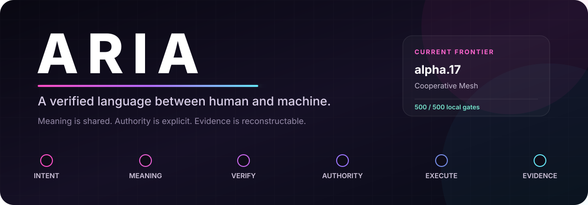
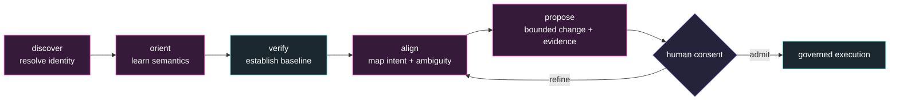
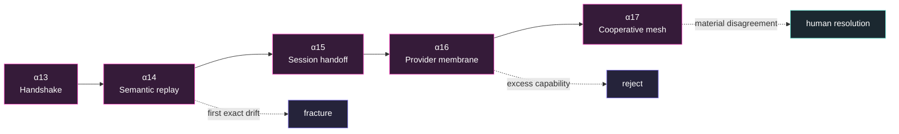
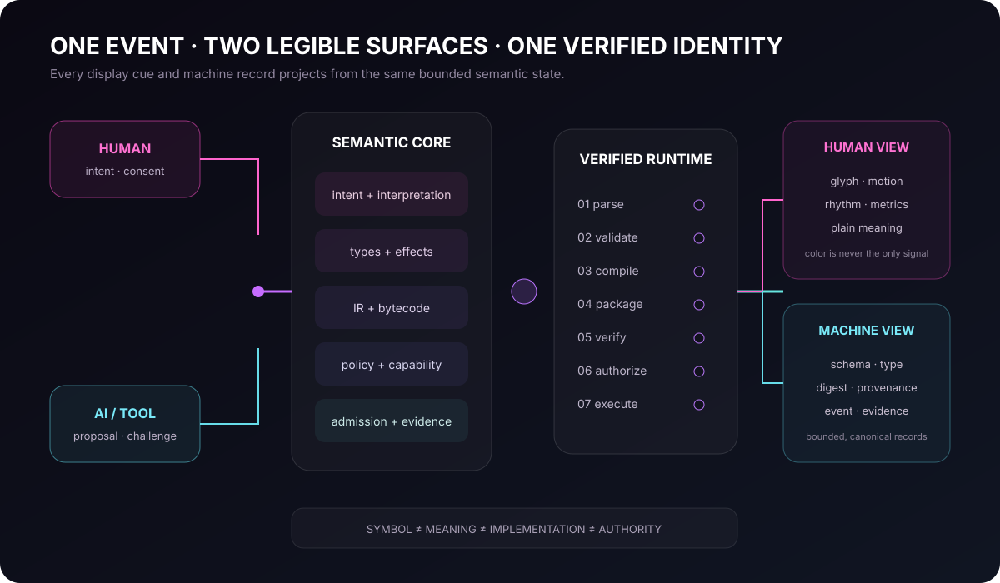
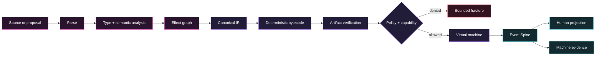
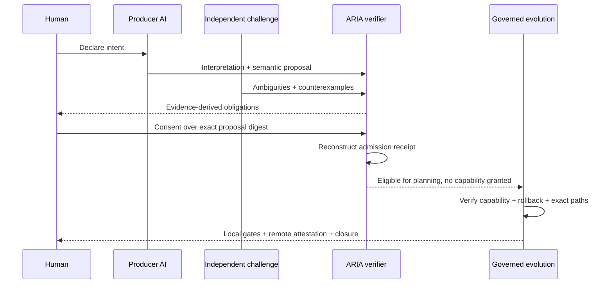

<div align="center">



</div>

| Gates | Release | Conformance | Bootstrap | License |
| :---: | :---: | :---: | :---: | :---: |
| [](https://github.com/jacksonjp0311-gif/ARIA/actions/workflows/ci.yml) |  |  |  | [](LICENSE) |

<div align="center">

**A local-first, typed programming language for shared human–AI semantics, verified computation, explicit authority, and governable evolution.**

[Quick start](#quick-start) · [See the language](#see-the-language) · [Architecture](#architecture) · [Trust model](#trust-model) · [Roadmap](#evolution-frontier) · [Documentation](#documentation)

</div>

---

> Alpha.18 adds capability-free constitutional function glyphs: `⋈` context
> weave, `≋` constitutional potential, `⌁` reversibility burden, `↧` authority
> descent, and `↶` verified recovery.

## The idea

ARIA is an experimental language and runtime built around one hard rule:

> **Nothing executes merely because it was requested. It executes only after structure, identity, types, effects, policy, capabilities, and artifact integrity have been verified.**

Most systems make code legible either to people or to machines. ARIA is exploring
a shared semantic layer in which both perceive the same computational event
through forms suited to them:

| Human surface | Shared fact | Machine surface |
|---|---|---|
| glyph, motion, rhythm, metric, explanation | one verified semantic state | schema, type, effect, transition, provenance, digest |
| stable visual pattern | one bounded operation | canonical event and evidence |
| explicit interpretation boundary | one authority decision | policy and capability result |

This is not an attempt to make symbols magical. ARIA preserves the distinction:

```text
symbol ≠ meaning ≠ implementation ≠ authority
```

A glyph can express meaning. It cannot grant permission. Motion can reveal a
transition. It cannot manufacture evidence. An AI can propose an interpretation.
It cannot approve its own proposal.

## Why ARIA

ARIA treats verification, authority, and operator understanding as language
semantics—not optional infrastructure around the language.

| Conventional default | ARIA default |
|---|---|
| execute, then inspect | verify, authorize, then execute |
| ambient process authority | explicit, scoped capabilities |
| logs assembled after the fact | human and machine views from one event stream |
| AI prose translated directly into action | intent → interpretation → challenge → consent → admission |
| repository changes reviewed as raw diffs | semantic proposal + exact paths + rollback + proof obligations |
| animation as decoration | temporal cues derived from real state transitions |

ARIA is useful as a research platform for:

- inspectable AI-generated programs;
- capability-limited local agents;
- deterministic and content-addressed execution;
- typed effect and authority analysis;
- human-learnable operational semantics;
- replayable, reversible language evolution.

It is alpha software, not a hardened production sandbox.

## Quick start

### Requirements

- Windows PowerShell 5.1 or PowerShell 7;
- Git;
- a local checkout of this repository.

```powershell
git clone https://github.com/jacksonjp0311-gif/ARIA.git
cd ARIA
.\aria.cmd doctor -Strict
.\aria.cmd test
```

Expected closure:

```text
◆ SYSTEM READY            PASS  all gates online
◆ ALL LATTICES COHERENT   PASS  512/512 gates
```

Run the first program:

```powershell
.\aria.cmd run .\examples\hello.aria
```

Explore the operator vocabulary:

```powershell
.\aria.cmd cue list
.\aria.cmd cue explain verification.seal
.\aria.cmd glyph list
.\aria.cmd events
```

### Connect an AI

An unfamiliar AI does not need a custom prompt or a guessed reading order.
ARIA exposes one deterministic semantic handshake:

```powershell
.\aria.cmd handshake --json
```

That record identifies the repository, runtime, guide, and connection contract;
binds each discovery resource to an exact digest; supplies the shared
vocabulary, synchronization phases, manifest state, and next valid command; and
states that initial authority is `none`.



The handshake makes discovery seamless; it does not make authority ambient.
See [Agent Semantic Handshake](docs/53-agent-semantic-handshake-alpha13.md).

### Continue across AIs

ARIA now carries verified meaning from one participant to many without copying
private conversation or combining authority:



| Layer | What moves | What never moves automatically |
|---|---|---|
| Replay | canonical semantic identity | external effects |
| Handoff | bounded artifact references | prompts, secrets, consent, authority |
| Provider bridge | verified transport eligibility | payload, network execution, capability activation |
| Cooperative mesh | shared state and independent challenges | consensus claims or aggregated authority |

## See the language

ARIA currently exposes two interoperable language surfaces.

### Source Core

Source Core is intentionally familiar: immutable bindings, typed functions,
expressions, conditionals, and pure output.

```aria
fn add(x: Int, y: Int) -> Int {
    x + y
}

emit add(20, 22);
```

```powershell
.\aria-source.cmd check .\examples\source-core\03-function.aria
.\aria-source.cmd run   .\examples\source-core\03-function.aria
.\aria-source.cmd ir    .\examples\source-core\03-function.aria
```

### Verified runtime language

The runtime surface exposes connections, effects, bytecode, policy, capability
checks, graph operations, evidence, and glyph-native algorithms.

```aria
aria 0.4.0
module VerifiedAlgorithmPipeline version 0.9.0
program VerifiedAlgorithmPipeline version 0.9.0
entry Main

function Double(value: Number) -> Number {
  ↩ value * 2
}

function Positive(value: Number) -> Bool {
  ↩ value > 0
}

function Add(total: Number, value: Number) -> Number {
  ↩ total + value
}

flow Main {
  let values: Sequence<Number> = [-2, -1, 1, 2]
  let total: Number = Σ(⫰(⨯(values, Double), Positive), Add, 0)
  emit total
  halt
}
```

```powershell
.\aria.cmd gate .\examples\verified-reduce.aria -Strict
.\aria.cmd run  .\examples\verified-reduce.aria
```

The glyphs are verified aliases over canonical semantics:

| Glyph | Spoken form | Meaning | Authority |
|---:|---|---|---|
| `▷` | invoke | call a verified function | none |
| `↩` | return | return a typed value | none |
| `≫` | pipe | compose typed stages left-to-right | none |
| `⨯` | map | apply a proven-pure unary transform | none |
| `⫰` | filter | stable selection by a proven-pure predicate | none |
| `Σ` | reduce | exact deterministic left fold | none |

Every glyph has a textual, spoken, and machine-readable identity. Glyph density
is not security; verification is.

## Architecture



ARIA’s compiler and runtime form a gated causal path:



### One state, synchronized projections

For actual system state \(S_t\), ARIA derives:

$$
S_t \longrightarrow (G_t,\;M_t,\;R_t,\;E_t)
$$

where:

- \(G_t\) is the stable glyphic expression;
- \(M_t\) is the motion and temporal contract;
- \(R_t\) is the canonical machine record;
- \(E_t\) is the bounded human explanation.

A state transition is governed by input, policy, and available evidence:

$$
S_{t+1}=F(S_t,\;I_t,\;P_t,\;V_t)
$$

The visible transition represents \(\Delta S_t\). Motion occurs because
information crossed a boundary, evidence was evaluated, an invariant fractured,
or coherence was reached—not merely because time passed.

### Runtime layers

| Layer | Responsibility | Primary implementation |
|---|---|---|
| Source | normalization, parsing, typed Source Core | `Aria.SourceCore.psm1` |
| Semantics | types, glyph lowering, policy checks | `Aria.Semantics.psm1` |
| Effects | call topology, transitive effects, purity | `Aria.Effects.psm1` |
| Artifact | deterministic bytecode and `.ariac` container | `Aria.Bytecode.psm1` |
| Verification | independent artifact reconstruction | `Aria.Gate.psm1` |
| Authority | capabilities, delegation, revocation, policy | `Aria.CapabilityAuthority.psm1` |
| Runtime | bounded stack machine and graph execution | `Aria.VM.psm1` |
| Observation | hash-chained events and semantic projections | `Aria.EventSpine.psm1` |
| Evidence | privacy-bounded per-card execution receipts | `Aria.ExecutionEvidence.psm1` |
| Evolution | proposals, consent, admission, rollback, apply | `Aria.SemanticProposal.psm1`, `Aria.Admission.psm1` |

## Trust model

ARIA separates four questions that are often collapsed:

1. **Is it structurally valid?** Syntax, identity, types, and bytecode.
2. **What can it affect?** Effect graph and capability requirements.
3. **Is it permitted here?** Policy, scope, delegation, and revocation.
4. **What actually happened?** Event history, execution evidence, and closure.

### Deny by default

Host effects are rejected unless policy allows the effect and an active
capability authorizes the exact resource.

```text
requested effect
  → policy allows effect?
  → capability identity valid?
  → capability active and unrevoked?
  → scope contains requested resource?
  → execute or reject
```

### Content-addressed identity

ARIA assigns deterministic SHA-256 identities to source, semantic IR, effect
graphs, bytecode, containers, policies, glyph cards, projections, proposals,
consent, admission, and evidence.

The same admitted inputs must yield the same semantic identity—or expose the
boundary that drifted.

### Truthful operator cues

| Cue | Means | Must not imply |
|---|---|---|
| traveling pulse | information crossed a bounded stage | receiver acceptance |
| authority clamp | permission is being evaluated | permission granted |
| verification seal | declared checks passed | universal truth or infallibility |
| fracture | a named invariant failed | blame or permission to bypass it |
| calm pending signal | process is alive; elapsed time is measured | invented percentage |

Color reinforces meaning but is never its only carrier. Reduced-motion and
static profiles preserve the same semantics.

See [Semantic Projection Core](docs/45-semantic-projection-core-alpha6.md) and
[Signal Integrity Closure](docs/46-signal-integrity-closure-alpha6-1.md).

## Governed human–AI evolution

ARIA now uses its own contracts to evolve the repository.



The governed path is:

```text
intent
→ interpretation
→ independent challenge
→ semantic proposal
→ human consent
→ deterministic admission
→ evolution planning
→ capability authorization
→ exact apply
→ local gates
→ remote attestation
→ closure
```

Critical boundaries:

- the producer cannot approve its own interpretation or proposal;
- consent binds an exact proposal, intent, path scope, and rollback scope;
- admission is evidence, not repository authority;
- apply rejects baseline, proposal, candidate, or path drift;
- force push is outside the governed path;
- failed remote closure must use a normal reversal commit.

```powershell
# Construct and verify semantic meaning without mutation
.\aria.cmd semantic propose .\semantic-proposal-request.json
.\aria.cmd semantic verify  .\semantic-proposal.json

# Record exact consent and reconstruct admission
.\aria.cmd admit consent .\consent-request.json
.\aria.cmd admit verify  .\admission-bundle.json

# Existing capability-gated repository transaction
.\aria.cmd evolve plan   .\examples\evolution-plan.json
.\aria.cmd evolve verify <proposal-id> `
  -Capability <bundle.json> `
  -Authorization <authorization.json> `
  -IssuerPolicy <verification-policy.json>
.\aria.cmd evolve apply  <proposal-id>
```

See [Semantic Proposal Bundles](docs/51-semantic-proposal-bundles-alpha11.md)
and [Consent and Admission Receipts](docs/52-consent-admission-receipts-alpha12.md).

## Current verified frontier

| Dimension | Current state |
|---|---|
| Release | `0.1.0-alpha.14` |
| Language specification | `0.4.0` |
| Aggregate conformance | `512/512` deterministic gates |
| Test lattices | 20 |
| Runtime lanes | Windows PowerShell 5.1, PowerShell 7 Windows, PowerShell 7 Ubuntu |
| Runtime | local PowerShell bootstrap VM |
| Host effects | deny by default |
| Algorithms | verified map, filter, reduce |
| Event history | hash-chained Event Spine v3 |
| AI continuity | handshake + replay + private handoff + provider membrane + cooperative mesh |
| Evolution | semantic proposal + independent consent + deterministic admission + governed apply |
| Next frontier | Capability-gated live provider adapter alpha.18 |

### Evolution ledger


The detailed sequence and admission contracts live in the
[canonical evolution plan](docs/41-aria-evolution-plan.md).

## Operator CLI

Run `.\aria.cmd help` for the complete command surface.

| Goal | Command |
|---|---|
| synchronize an AI | `.\aria.cmd handshake --json` |
| construct semantic replay | `.\aria.cmd replay create <request.json> --json` |
| create bounded handoff | `.\aria.cmd handoff create <request.json> --json` |
| evaluate provider eligibility | `.\aria.cmd bridge create <request.json> --json` |
| form cooperative mesh | `.\aria.cmd mesh create <request.json> --json` |
| verify installation | `.\aria.cmd doctor -Strict` |
| run every lattice | `.\aria.cmd test` |
| verify repository identity | `.\aria.cmd verify` |
| reseal repository manifest | `.\aria.cmd manifest` |
| gate a program | `.\aria.cmd gate <program.aria> -Strict` |
| compile an artifact | `.\aria.cmd compile <program.aria>` |
| execute source | `.\aria.cmd run <program.aria>` |
| execute artifact | `.\aria.cmd exec <program.ariac>` |
| inspect artifact | `.\aria.cmd inspect <program.ariac>` |
| inspect effect graph | `.\aria.cmd effects <program.aria>` |
| inspect graph | `.\aria.cmd graph <program.aria>` |
| inspect event history | `.\aria.cmd events` |
| explain a cue | `.\aria.cmd cue explain <cue-id>` |
| inspect glyph memory | `.\aria.cmd glyph memory` |
| verify intent | `.\aria.cmd intent verify <bundle.json>` |
| manage Git safely | `.\aria.cmd pull`, `push`, or `sync` |

Add `-VerboseOutput`, or set `ARIA_VERBOSE=1`, to expose bounded diagnostic
detail.

## Repository map

```text
ARIA/
├── aria.cmd / aria.ps1       canonical operator CLI
├── aria-source.cmd           Source Core CLI
├── grammar/                  syntax, opcodes, glyphs, semantic cues
├── schemas/                  machine-readable contracts
├── src/                      compiler, verifier, VM, authority, evidence
├── examples/                 executable language examples
├── plans/                    ARIA-authored evolution and intent artifacts
├── tests/                    deterministic conformance lattices
├── docs/
│   ├── adr/                  architectural decisions
│   ├── algorithms/           implementation invariants
│   ├── research/             research maps and open questions
│   └── assets/               deterministic project visuals
├── ARIA-CONNECT.json         canonical AI connection contract
├── ARIA-RUNTIME.json         machine discovery surface
├── MANIFEST.sha256           sealed repository identity
└── AGENTS.md                 operational guide for coding agents
```

## Documentation

Choose the shortest path for what you need.

### Understand the language

- [Project charter](docs/00-charter.md)
- [Language specification](docs/01-language-spec.md)
- [Mathematical model](docs/02-mathematical-model.md)
- [Glyph alphabet](docs/03-glyph-alphabet.md)
- [Bytecode and container](docs/04-bytecode-and-container.md)
- [VM and memory](docs/05-vm-and-memory.md)

### Understand verification and authority

- [Capability security](docs/06-capability-security.md)
- [Compiler gates](docs/07-compiler-gates.md)
- [Typed authority core](docs/27-typed-authority-core.md)
- [Capability authority](docs/30-capability-authority.md)
- [Intent verification](docs/36-intent-verification.md)

### Understand the human–machine interface

- [Agent Semantic Handshake](docs/53-agent-semantic-handshake-alpha13.md)
- [Deterministic Semantic Replay](docs/54-deterministic-semantic-replay-alpha14.md)
- [Portable Session Handoff](docs/55-portable-session-handoff-alpha15.md)
- [Provider Bridge Membrane](docs/56-provider-bridge-membrane-alpha16.md)
- [Cooperative Agent Mesh](docs/57-cooperative-agent-mesh-alpha17.md)
- [AI bridge boundary](docs/08-ai-bridge.md)
- [Connectflow](docs/16-connectflow.md)
- [Operator renderer](docs/13-operator-renderer.md)
- [Etherflow](docs/19-etherflow.md)
- [Event Spine](docs/20-event-spine.md)
- [Semantic Projection Core](docs/45-semantic-projection-core-alpha6.md)
- [Signal Integrity Closure](docs/46-signal-integrity-closure-alpha6-1.md)

### Understand language evolution

- [Governed evolution](docs/31-governed-evolution.md)
- [Evolution planning](docs/34-evolution-planning.md)
- [Evolution verification](docs/35-evolution-verification.md)
- [Evolution application](docs/36-evolution-application.md)
- [Canonical evolution plan](docs/41-aria-evolution-plan.md)
- [Semantic Proposal Bundles](docs/51-semantic-proposal-bundles-alpha11.md)
- [Consent and Admission Receipts](docs/52-consent-admission-receipts-alpha12.md)

The complete catalog is in the [documentation index](docs/README.md).

## Development

Before changing compiler, verifier, runtime, authority, schemas, or evolution
contracts:

```powershell
.\aria.cmd doctor -Strict
.\aria.cmd test
```

After the change:

```powershell
.\aria.cmd manifest
.\aria.cmd doctor -Strict
.\aria.cmd test
```

Every evolution must preserve:

- deterministic identities;
- deny-by-default authority;
- exact path and rollback boundaries;
- PowerShell 5.1 and PowerShell 7 compatibility;
- machine discovery and documentation;
- the distinction between evidence and authority.

Read [CONTRIBUTING.md](CONTRIBUTING.md), [SECURITY.md](SECURITY.md), and
[AGENTS.md](AGENTS.md) before contributing.

## Guidance for AI agents

Start with:

```powershell
.\aria.cmd handshake --json
```

The handshake provides the canonical read order, exact resource identities,
shared vocabulary, baseline state, and next valid boundary. Follow it with
`.\aria.cmd doctor -Strict`. Treat generated output as a proposal, not
permission. Never bypass a failed gate, rewrite history, expose secrets, or
infer authority from a seal, receipt, handshake, or successful test.

Preferred task model:

```text
discover identity
→ orient to shared semantics
→ verify baseline
→ declare intent
→ identify assumptions and ambiguity
→ propose bounded meaning
→ verify exact effects and paths
→ obtain independent consent
→ implement
→ run local gates
→ obtain remote attestation
→ seal replay state
→ hand off only bounded references
→ preserve independent challenge in any mesh
→ report exact closure
```

## Evolution frontier

The next bounded milestone is **Capability-Gated Live Provider Adapter alpha.18**:

> Consume an eligible alpha.16 provider membrane through an explicit network
> capability, transmit a privacy-filtered payload, verify the response
> envelope, and return evidence to the alpha.17 mesh without granting the model
> authority.

After Epoch III closes, ARIA’s PowerShell implementation is intended to become
a frozen reference oracle for a native front end. It will be preserved as
evidence, not discarded.

See the [roadmap](docs/11-roadmap.md) and
[canonical evolution plan](docs/41-aria-evolution-plan.md).

## Project doctrine

1. **Semantics before aesthetics.**
2. **Verification before execution.**
3. **Explicit authority before effects.**
4. **Canonical identity before trust.**
5. **Evidence before claims.**
6. **Accessibility before novelty.**
7. **Reversibility before acceleration.**
8. **Human agency before engagement.**

ARIA should feel alive because real information is moving, real boundaries are
being evaluated, and real states are changing—not because the interface is
pretending.

## License

Licensed under the [Apache License 2.0](LICENSE).

---

<div align="center">

**Make computation perceptible without making it dishonest.**

</div>
